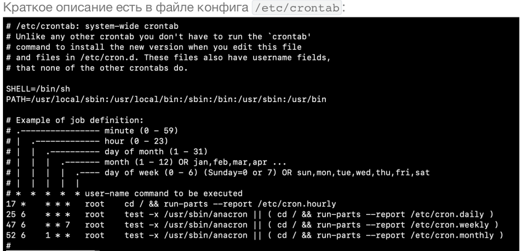

# Выполнение лабораторной работы №1

###

[Лабораторная №1](L1.pdf)

### Установка сервера
Выполнено на VPS сбера.

__Root__ (англ. root — корень; читается «рут»), или суперпо́льзователь — это специальный
аккаунт и группа пользователей в UNIX-подобных системах с идентификатором UID 0
(User IDentifier), владелец которого имеет право на выполнение всех без исключения
операций. Суперпользователь UNIX-систем имеет логин «root» только по умолчанию и
легко переименовывается при необходимости, часто встречается переименование в
«toor» для усложнения подбора паролей автоматическими сканерми.

__su__ (англ. Substitute User, Set UID, Switch User, Super User — замена пользователя,
переключение пользователя, суперпользователь) — команда Unix-подобных
операционных систем, позволяющая пользователю войти в систему под другим именем,
не завершая текущий сеанс. Обычно используется для временного входа
суперпользователем для выполнения административных работ. По умолчанию
предполагается работа от имени пользователя root. `su -`, среда будет установлена такой же, как при регистрации заданного пользователя.
Иначе передается текущая среда, за исключением значения $PATH, которое задается
переменными PATH и SUPATH в файле /etc/default/su .

__sudo__ (англ. Substitute User and do, дословно «подменить пользователя и выполнить») — программа для системного администрирования UNIX-систем, позволяющая делегировать
те или иные привилегированные ресурсы пользователям с ведением протокола работы.
Основная идея — дать пользователям как можно меньше прав, но при этом достаточных для решения поставленных задач.

1. `sudo -i` - становимся рутом.

2. Проверить группу wheel в /etc/sudoers. Ее права.
Проверил: 
`[root@vm-4ead79c4-8bca-4223-86b6-eb709fd1c86a ~]# awk '!/^#/' /etc/sudoers | grep wheel`

__%wheel	ALL=(ALL)	ALL__

Для информации:
__%wheel__ ALL=(ALL:ALL) ALL
Первое поле показывает имя пользователя или группы, к которым будет применяться правило, в данном случае к группе wheel, для пользователя нужно убрать % .

%wheel __ALL__=(ALL:ALL) ALL
Первое “ALL” означает, что данное правило применяется ко всем хостам.

%wheel ALL=(__ALL__:ALL) ALL
Данное “ALL” означает, что пользователь группы wheel может запускать команды от лица всех пользователей.

%wheel ALL=(ALL:__ALL__) ALL
Данное “ALL” означает, что пользователь группы wheel может запускать команды от лица всех групп.

%wheel ALL=(ALL:ALL) __ALL__
Последнее “ALL” означает, что данные правила применяются всем командам

### Пользователи

Создать пользователя ansible
`useradd -m -s /bin/bash ansible`

Устанавливаем ему пароль, чтобы не светить в хистори через ключ -p
`passwd ansible` (рут или sudo нужен)

Дополнительно, вне лабы создал файлик в /etc/sudoers.d/

`# cat /etc/sudoers.d/ansible`
>#Created by cloud-init v. 18.5 on Fri, 15 Mar 2024 04:08:32 +0000
>#User rules for user1
>ansible ALL=(ALL) NOPASSWD:ALL

Создаем директорию /admin в корне:
`mkdir /admin`

Owner:группа = ansible:wheel
`chown ansible:wheel /admin`

Права: чтение редактирование ansible, wheel чтение
`chmod 640 /admin`

Добавить в .bashrc root и пользователей:

>shopt -s histappend
>HISTSIZE=10000
>HISTFILESIZE=10000
>HISTIGNORE='man:ls:history*'
>HISTTIMEFORMAT='%d.%m.%Y %H:%M:%S: '
>PROMPT_COMMAND='history -a'

### Настройки сети

Смотрим на свои сетевые интерфейсы и списки маршрутов:\
`ip a`  сокращение от ip address\
`ip r`  сокращение от ip route

>Для любителей старины, стоит знать:

`apt install net-tools`  ставим пакет старых утилит управления сетью\
`ifconfig`  аналог ip a\
`route -n`  аналог ip r\

Запомните свой IP и GW:
`$ ip a | grep -v '127.0.0.1' | grep 'inet '`
inet __10.0.0.5/24__ brd 10.0.0.255 scope global dynamic noprefixroute __eth0__

`$ ip r`
default via 10.0.0.1 dev eth0 proto dhcp metric 100 
10.0.0.0/24 dev eth0 proto kernel scope link src 10.0.0.5 metric 100

__IP - 10.0.0.5 --> 176.109.104.189__
__GW - via 10.0.0.1__

### Подключение по SSH

SSH (англ. Secure Shell — «безопасная оболочка») — сетевой протокол прикладного уровня, позволяющий производить удалённое управление операционной системой и туннелирование TCP-соединений (например, для передачи файлов). Схож по функциональности с более старыми протоколами Telnet и rlogin, но, в отличие от них, шифрует весь трафик, включая ипередаваемые пароли. SSH допускает выбор различных алгоритмов шифрования. [Больше про SSH](https://github.com/iu5git/linux-course/blob/master/Wiki.md#ssh).

[Using the SSH Config File](https://linuxize.com/post/using-the-ssh-config-file/)

Установить и запустить SSHD.

На клиенте сгенерировать __ssh-keygen__

и скопировать на сервер в каталог пользователя __ssh-copy-id__

Продемонстрировать подключение по ssh под
пользователем ansible и стать root-ом с помощью sudo.
Выполнено.

### Установка и работа с tmux
Tmux - терминальный мультиплексор. Очень удобная штука для работы с несколькимисессиями в системе (или несколькими системами). Позволяет открывать и поддерживать на сервере несколько сессий. Что гарантирует защиту от внезпного завершения процессов в вашей консоли при разрыве соединения без использования nohup . [Статья тут](https://habr.com/ru/post/327630/)

`ctrl+b ... c` создание нового окна
`ctrl+b ... w` переключение между окнами
`ctrl+b ... l` переключение между 2-мя последними
`ctrl+b ... 0` переключиться на конкретное окно по его номеру, например первое
`ctrl+b ... d` Если нужно отключиться без завершения сессий
`ctrl+b ... x` закрытие окна с подтверждением

Для повторного подключения к нужной сессии tmux a -t $ID :
`tmux a -t 0`

### Продвинутая работа с системой

Выведем LA:
`cat /proc/loadavg | awk '{ print $1,$2,$3" processes: "$4", last PID: "$5}'`

__LA, Load average__ - среднее значение загрузки системы за некоторый период времени, как правило, отображается в виде трёх значений, которые представляют собой усредненные сглаженные величины за последние 1, 5 и 15 минут. Вычисляется как длина очереди выполнения в операционной системе, где единица означает, что очередь
заполнена, а значение выше единицы — что есть процессы, которые ожидают своей очереди на выполнение. Содержатся в файле /proc/loadavg . Учитывает как running процессы, так и процессы в uninterraprable sleep (ожидают выполнения системного вызова, как правило долгие это read/write, т.е. IO).

Выведем 

`sudo ss -4tuln | awk '{ print $5 }' | column -t`

Выведем список ip адресов на хосте

`ip a | grep -E 'inet ' | awk '{ print $2 }'`

[Скрипт лежит здесь](../Lab1/scrpts/beholder.sh)
[Дополнительно таблица команд для анализа оборудования](../Lab1/additions/linux_hardwareinfo.md)

### Делаем сбор данных регулярным с cron

Создаем задачу cron
`crontab -e`

`crontab -l` - просмотреть задачи

 

>Исходя из этого конфига следует, что в /etc/cron.{hourly,daily,
weekly,monthly} лежат скрипты, запускающиеся соответственно раз в день, внеделю и в месяц. Дополнительно Cron читает конфиги из /etc/cron.d/ , где лежатобщие файлы с расписанием запуска.
Кроме того, для пользователей задаются персональные cron-конфиги. Их можно отредактировать с помощью утилиты crontab -e . Они отличаются от /etc/crontab тем, что там опускается поле пользователя, запускаться будет от того, который себе задал это в настройках.

Задачи сформировать мегаполезный скрипт нет, идем по плану лабораторной. Задание создано.
`[tguser@vm-4ead79c4-8bca-4223-86b6-eb709fd1c86a scripts]$ crontab -l`
`* * * * * /home/tguser/scripts/beholder.sh > /tmp/be-out`

### Пишем свой systemd-сервис
Содержательная вводная часть в самой [лабораторной.](L1.pdf)

### Установить Docker

Делаю так:
[Docker. Install using the convenience script](https://docs.docker.com/engine/install/ubuntu/#install-using-the-convenience-script)

You can run the script with the `--dry-run` option to learn what steps the script will run when invoked:

 `curl -fsSL https://get.docker.com -o get-docker.sh`
`sudo sh ./get-docker.sh --dry-run`

This example downloads the script from https://get.docker.com/
and runs it to install the latest stable release of Docker on Linux:

`curl -fsSL https://get.docker.com -o get-docker.sh`
`sudo sh get-docker.sh`

You have now successfully installed and started Docker Engine. The docker service starts automatically on Debian based distributions. On RPM based distributions, such as CentOS, Fedora, RHEL or SLES, you need to start it manually using the appropriate systemctl or service command. As the message indicates, non-root users can't run Docker commands by default.

__Upgrade Docker after using the convenience script__

If you installed Docker using the convenience script, you should upgrade Docker using your package manager directly. There's no advantage to re-running the convenience script. Re-running it can cause issues if it attempts to re-install repositories which already exist on the host machine.

### Удалить Docker

Uninstall Docker Engine

Uninstall the Docker Engine, CLI, containerd, and Docker Compose packages:

 `sudo apt-get purge docker-ce docker-ce-cli containerd.io docker-buildx-plugin docker-compose-plugin docker-ce-rootless-extras`

Images, containers, volumes, or custom configuration files on your host aren't automatically removed. To delete all images, containers, and volumes:

 `sudo rm -rf /var/lib/docker`
 `sudo rm -rf /var/lib/containerd`

You have to delete any edited configuration files manually.

# Linux post-installation steps for Docker Engine

[Linux post-installation steps for Docker Engine](https://docs.docker.com/engine/install/linux-postinstall/)

### Дополнительно

- [Как скопировать скрипт с Google Drive](../Lab1/additions/Copy%20script%20from%20google%20drive.%20Curl.md)
- [Управление ресурсами с помощью ulimit](https://andreyex.ru/linux/komandy-linux-i-komandy-shell/upravlenie-resursami-sistemy-s-pomoshhyu-komandy-ulimit/)

