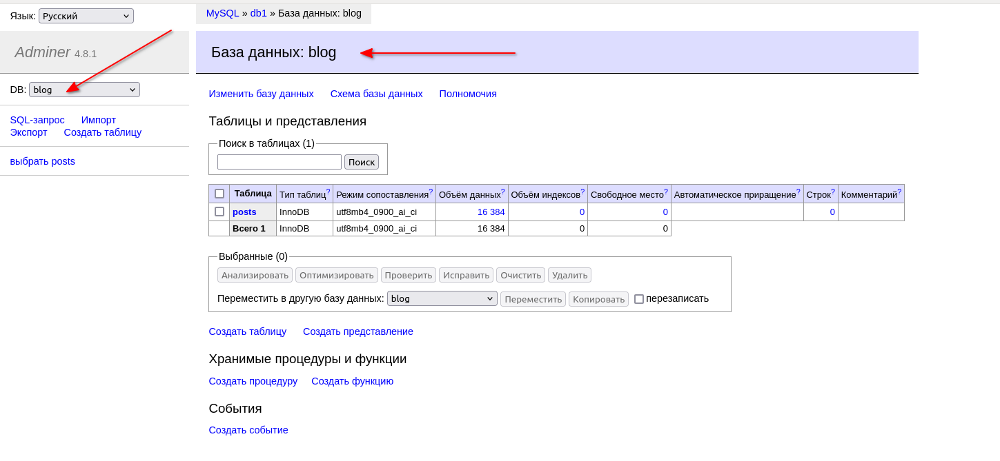

# Лабораторная работа №2. Контейнеризация Docker. Латыпов А.Ф.

### Установка

```bash
#!/bin/bash
echo "Attempt to install Docker..."
curl -fsSL https://get.docker.com -o get-docker.sh && sudo sh get-docker.sh
```

### Проверка демона
```bash
[tguser@tg-server ~]$ systemctl status containerd.service
● containerd.service - containerd container runtime
   Loaded: loaded (/usr/lib/systemd/system/containerd.service; disabled; vendor \preset: disabled)\
   Active: __active__ (running) since Mon 2024-04-29 21:52:22 MSK; 21h ago
```

### Запускаем 

`docker run hello-world`++

### Пользователь в группе docker

[tguser@tg-server ~]$ __groups__\
tguser wheel users __docker__

`usermod -aG docker tguser`

### Пулим mysql

```bash
[tguser@tg-server ~]$ docker pull mysql
Using default tag: latest
latest: Pulling from library/mysql
bd37f6d99203: Pull complete 
e733cb057651: Pull complete 
af2fd35011dc: Pull complete 
e5233d0f6ee3: Pull complete 
cf11fd8658d3: Pull complete 
85344d57c3cb: Pull complete 
0eebca71f40d: Pull complete 
18e468a1ddac: Pull complete 
d9b2b8d35c75: Pull complete 
57ba1b7684b4: Pull complete 
Digest: sha256:9de9d54fecee6253130e65154b930978b1fcc336bcc86dfd06e89b72a2588ebe
Status: Downloaded newer image for mysql:latest
docker.io/library/mysql:latest
```

and mysql:5.7.39

```bash
[tguser@tg-server ~]$ docker image ls
REPOSITORY            TAG             IMAGE ID       CREATED         SIZE
mysql                 latest          6f343283ab56   5 weeks ago     632MB
mysql                 5.7.39          eb175b0743cc   19 months ago   433MB
```

### Метки и удаление
```bash
[tguser@tg-server ~]$ docker tag mysql mysql:8.0-mak

[tguser@tg-server ~]$ docker rmi mysql:8.0-mak 
Untagged: mysql:8.0-mak

[tguser@tg-server ~]$ docker image rm mysql:5.7.39
Untagged: mysql:5.7.39
Untagged: mysql@sha256:a85b8313feb7298ae240c4beb33a1b4d2e3a3867d3195bab9ed9346d332217c7
Deleted: sha256:eb175b0743cc4475f4440b3d9dacbe7e3f29dc455a60999ce260366709bb1d00
Deleted: sha256:603c05f8bb7a61bdb4a812e8f1070cc67360d9fd5ccc95298533d33fb49ea3fc
Deleted: sha256:33ce798cd848dcb1bfe8093ee8ef75d6565904f5e7c81799f4906fb23ed70481
Deleted: sha256:cd3cda92774f3452bf8977a1a78332aa94ee33495d53922df101f65c0f74dd17
Deleted: sha256:76ac799b9197737abfb89eae3ed6f831a997c81aa7689cbb1ea053e0e6f9c6fb
Deleted: sha256:bf04950f90a38ff8d1ea89ebb09fe2abe5d75eda11301d14872897083fa31d80
Deleted: sha256:5f9fa5514520686872156469b3728591216c3e65616744854e85f7d5453c08e5
Deleted: sha256:f39f3b129ad2c9f72bc759ea87af4308772807610b3d128563a2db38943bccce
Deleted: sha256:14f19f828449b597821b2052c6431b216fd46db1f6d38357381035218a494fc2
Deleted: sha256:102719eaa032100eea845ae9d63a9c58255a83418a5b5996084c97e694e8f876
Deleted: sha256:6ef31e2f18a5551e8e986d64889630600d18a5bfa841d6d50678b94e374c8fd5
Deleted: sha256:94ed4b3256a9d220fd33f19fa8df172497281108954c1e370e759ede3d748748
```

`docker image prune -a` - удалить все, на которых не запущены контейнеры

### Запускаем контейнер
```bash
[tguser@tg-server ~]$ docker run mysql
2024-04-30 16:58:10+00:00 [Note] [Entrypoint]: Entrypoint script for MySQL Server 8.3.0-1.el8 started.
2024-04-30 16:58:10+00:00 [Note] [Entrypoint]: Switching to dedicated user 'mysql'
2024-04-30 16:58:10+00:00 [Note] [Entrypoint]: Entrypoint script for MySQL Server 8.3.0-1.el8 started.
2024-04-30 16:58:10+00:00 [ERROR] [Entrypoint]: Database is uninitialized and password option is not specified
    You need to specify one of the following as an environment variable:
    - MYSQL_ROOT_PASSWORD
    - MYSQL_ALLOW_EMPTY_PASSWORD
    - MYSQL_RANDOM_ROOT_PASSWORD
```

Исправляемся, добавляем аргумент -e для передачи переменной окружения, -d - в фоновом режиме
```bash
[tguser@tg-server ~]$ docker run -d -e MYSQL_ROOT_PASSWORD=password --name mydb mysql
0a635e53f02d3432fe95eceb6bd99eba7b0a717ce4b50e12eb6bb485ee671b0e
```

Получаем хэш контейнера, ID

Контейнер в работе
```bash
[tguser@tg-server ~]$ docker ps
CONTAINER ID   IMAGE                 COMMAND                  CREATED         STATUS         PORTS                                       NAMES
0a635e53f02d   mysql                 "docker-entrypoint.s…"   3 minutes ago   Up 3 minutes   3306/tcp, 33060/tcp                         mydb
581f32de7b79   grafana/grafana-oss   "/run.sh"                5 weeks ago     Up 22 hours    0.0.0.0:3000->3000/tcp, :::3000->3000/tcp   London
```

### Подключение к контейнеру

`i - interactive - держать STDIN открытым`
`t - tty - создать псевдо-tty`

```bash
[tguser@tg-server ~]$ docker exec -it mydb /bin/bash
bash-4.4# uname -a
Linux 0a635e53f02d 4.18.0-348.7.1.el8_5.x86_64 #1 SMP Wed Dec 22 13:25:12 UTC 2021 x86_64 x86_64 x86_64 GNU/Linux
bash-4.4# mysql
ERROR 1045 (28000): Access denied for user 'root'@'localhost' (using password: NO)
bash-4.4# mysql -u root -p
Enter password: 
ERROR 1045 (28000): Access denied for user 'root'@'localhost' (using password: YES)
bash-4.4# mysql -u root -p
Enter password: 
Welcome to the MySQL monitor.  Commands end with ; or \g.
Your MySQL connection id is 10
Server version: 8.3.0 MySQL Community Server - GPL

Copyright (c) 2000, 2024, Oracle and/or its affiliates.

Oracle is a registered trademark of Oracle Corporation and/or its
affiliates. Other names may be trademarks of their respective
owners.

Type 'help;' or '\h' for help. Type '\c' to clear the current input statement.

mysql> show schemas
    -> 
    -> ^C
mysql> show schemas;
+--------------------+
| Database           |
+--------------------+
| information_schema |
| mysql              |
| performance_schema |
| sys                |
+--------------------+
4 rows in set (0.01 sec)

mysql> 
```

### Смотрим список изменений

`docker diff mydb`
```bash
bash-4.4# cat > file.txt
Hello^C
bash-4.4# ls
bin  boot  dev	docker-entrypoint-initdb.d  etc  file.txt  home  lib  lib64  media  mnt  opt  proc  root  run  sbin  srv  sys  tmp  usr  var
bash-4.4# ls | grep file
file.txt
bash-4.4# cat > file2.txt
Testing diff
bash-4.4# ls | grep file
file.txt
file2.txt
bash-4.4# exit
exit
[tguser@tg-server ~]$ docker diff mydb 
C /run
C /run/mysqld
A /run/mysqld/mysqld.pid
A /run/mysqld/mysqld.sock
A /run/mysqld/mysqld.sock.lock
A /run/mysqld/mysqlx.sock
A /run/mysqld/mysqlx.sock.lock
A /file2.txt
A /file.txt
C /root
A /root/.bash_history
A /root/.mysql_history
```

Видим 2 файла дополнительно.

### Завершение работы контейнера

`docker stop db1 - нежно завершить`\
`docker kill db1 - грубо и сразу`\
`docker rm db1 - удалить остатки, включая логи`

```bash
[tguser@tg-server ~]$ docker stop mydb 
mydb
[tguser@tg-server ~]$ docker rm mydb 
mydb
```
### Не теряем данные - docker volume

`docker run -d -e MYSQL_ROOT_PASSWORD=password --name db1 mysql`
> пароль в истории bash

>Как избежать утечки пароля через историю bash?
```bash
vim .docker_mysql_rc
# Вписываем необходимые переменные

# Передаем как переменную (если одна)
source .docker_mysql_rc
docker run -d -e MYSQL_ROOT_PASSWORD=${MYSQL_ROOT_PASSWORD} --name db1 mysql

# Или целиком файл (если много):
docker run -d --env-file ./.docker_mysql_rc --name db1 mysql
```

Контейнер ранее удалили. Проверяем отсутствие ранее созданного файла file2.txt

```bash
[tguser@tg-server ~]$ docker exec -it db1 cat file2.txt
cat: file2.txt: No such file or directory
```

Запускаем контейнер с томом:

```bash
[tguser@tg-server ~]$ docker run --rm -d \
-v mysql:/var/lib/mysql \
-v mysql_config:/etc/mysql \
--name db1 \
-e MYSQL_ROOT_PASSWORD=${MYSQL_ROOT_PASSWORD} \
mysql
01b0b26221ed7c549cd644ddd1e68d0f64a22d0cf4261ce9eb415d3fb01aff01
```

Внесем изменения:

`docker exec -it db1 mysql -p`\
`-p - ввод пароля интерактивно`

```bash
create database testdb;
create database blog;
show schemas;

mysql> show schemas;
+--------------------+
| Database           |
+--------------------+
| blog               |
| information_schema |
| mysql              |
| performance_schema |
| sys                |
| testdb             |
+--------------------+
6 rows in set (0.00 sec)
```

Остановим контейнер и убедимся, что testdb и blog не исчезли (как и все изменения на ФС)

```bash
[tguser@tg-server ~]$ docker stop db1
db1
[tguser@tg-server ~]$ docker run --rm -d -v mysql:/var/lib/mysql -v mysql_config:/etc/mysql --name db1 -e MYSQL_ROOT_PASSWORD=${MYSQL_ROOT_PASSWORD} mysql
2cbe3c1fabe50a27b68906491bfd8c5607edfedf31f985bdbf55fd85cc24d41c
[tguser@tg-server ~]$ docker exec -it db1 mysql -p -e "show schemas;"
Enter password: 
+--------------------+
| Database           |
+--------------------+
| blog               |
| information_schema |
| mysql              |
| performance_schema |
| sys                |
| testdb             |
+--------------------+
[tguser@tg-server ~]$ 
```

Управление томами:

[Просмотреть список томов](https://docs.docker.com/engine/reference/commandline/volume_ls/):\
`docker volume ls`

[Создать новый](https://docs.docker.com/engine/reference/commandline/volume_create/):\
`docker volume create test`

[Посмотреть информацию о томе](https://docs.docker.com/engine/reference/commandline/volume_inspect/):\
`docker volume inspect test`

[Удалить том](https://docs.docker.com/engine/reference/commandline/volume_rm/):\
`docker volume rm test`

[Очистить лишние тома](https://docs.docker.com/engine/reference/commandline/volume_prune/):\
`docker volume prune`

### Контейнер Adminer

Запустим образ [Adminer](https://hub.docker.com/_/adminer). внутрь контейнера на порт 8080 попадаем так\
`-p HostPort:ContainerPort`:

`docker run -d -p 8080:8080 --name adminer adminer`

Смотрим порт:\
```bash
[tguser@tg-server ~]$ ss -tlpn | grep 8080
LISTEN 0      128          0.0.0.0:8080      0.0.0.0:*          
LISTEN 0      128             [::]:8080         [::]:*           
```

Мой VPS с внешним ip адресом, проверяю есть ли доступ:
```bash
aflw@PKL-VIVO:~$ telnet ############ 8080
Trying ##########...
Connected to ############.

aflw@PKL-VIVO:~$ :> /dev/tcp/###.###.###.###/8080
aflw@PKL-VIVO:~$ echo $?
0
```

Через браузер получаю доступ к веб форме админера.

**Adminer** (бывший phpMinAdmin) — это легковесный инструмент администрирования [MySQL](https://ru.wikipedia.org/wiki/MySQL), [PostgreSQL](https://ru.wikipedia.org/wiki/PostgreSQL), [SQLite](https://ru.wikipedia.org/wiki/SQLite), [MS SQL](https://ru.wikipedia.org/wiki/MS_SQL) и [Oracle](https://ru.wikipedia.org/wiki/Oracle_(СУБД)). Проект родился как «облегчённый» вариант [phpMyAdmin](https://ru.wikipedia.org/wiki/PhpMyAdmin). Распространяется в форме одиночного [PHP](https://ru.wikipedia.org/wiki/PHP)-файла размером около 380 KB, который является результатом компиляции исходных php- и js-файлов с помощью специального PHP-скрипта. Т.о. контейнер с ним содержит php-сервер и один php-скрипт.

Однако как бы мы не пытались подключиться к базе - ничего не выйдет. Котейнеры не связаны по сети.

### Сети - docker network

Сначала пробую связать контейнер простым способом, с параметром `--link Container:AliasName`\
```bash
[tguser@tg-server ~]$ docker rm -f adminer 
adminer
[tguser@tg-server ~]$ docker run -d -p 8080:8080 --link db1:mysql --name adminer adminer
2a9fd5d036c660675628554bb9b97787896cccfb2cd7661744407ef977ffaa1a
```
<br>


<br>


Такой способ считается устаревшим. Создаю новую сеть:

```bash
[tguser@tg-server ~]$ docker network create cluster
af65ef41e93d21c531962d20104815000ed1897b1a0e0e558ee7f76150546fdf
```

Почитай man, много интесного `man docker-network-create`

Проверим, как создалась сеть с параметрами по умолчанию:


<br>

```bash
[tguser@tg-server ~]$ docker network inspect cluster
[
    {
        "Name": "cluster",
        "Id": "af65ef41e93d21c531962d20104815000ed1897b1a0e0e558ee7f76150546fdf",
        "Created": "2024-05-01T09:53:59.949052325+03:00",
        "Scope": "local",
        "Driver": "bridge",
        "EnableIPv6": false,
        "IPAM": {
            "Driver": "default",
            "Options": {},
            "Config": [
                {
                    "Subnet": "172.19.0.0/16",
                    "Gateway": "172.19.0.1"
                }
            ]
        },
        "Internal": false,
        "Attachable": false,
        "Ingress": false,
        "ConfigFrom": {
            "Network": ""
        },
        "ConfigOnly": false,
        "Containers": {},
        "Options": {},
        "Labels": {}
    }
]
```

В какой сети сейчас работают adminer и mysql?

```bash
docker inspect db1
docker inspect adminer | egrep "IPAddress|Gateway|IPPrefixLen"
```

```bash
[tguser@tg-server ~]$ docker inspect adminer | egrep "IPAddress|Gateway|IPPrefixLen"
            "SecondaryIPAddresses": null,
            "Gateway": "172.17.0.1",
            "IPAddress": "172.17.0.3",
            "IPPrefixLen": 16,
            "IPv6Gateway": "",
                    "Gateway": "172.17.0.1",
                    "IPAddress": "172.17.0.3",
                    "IPPrefixLen": 16,
                    "IPv6Gateway": "",
```

Пересоздаю контейнеры mysql и adminer в сети:

```bash
docker rm -f db1
docker rm -f adminer
```
```bash
# Добавим к предыдущей команде запуска: --net NetName
docker run --rm -d \
	-v mysql:/var/lib/mysql \
	-v mysql_config:/etc/mysql \
	--name db1 \
	-e MYSQL_ROOT_PASSWORD=password \
	--net cluster \
	mysql

# А теперь аналогично для Adminer
docker run -d -p 8080:8080 --net cluster --name adminer adminer
```
Мой терминал:

```bash
[tguser@tg-server ~]$ docker run --rm -d -v mysql:/var/lib/mysql -v mysql_config:/etc/mysql --name db1 -e MYSQL_ROOT_PASSWORD=${MYSQL_ROOT_PASSWORD} --net cluster mysql
e7eea232a56c8d206d726c89d699b48e04348be3c7967288d1676860bb63e33e
[tguser@tg-server ~]$ docker run -d -p 8080:8080 --net cluster --name adminer adminer
af6d3c4e9907ef875955737c05f1f1d3a9956ec2298570a00a58b55a6b29124f
```

Проверяем их ip:\
`docker inspect db1 | egrep "IPAddress|Gateway|IPPrefixLen"`
`docker inspect adminer | egrep "IPAddress|Gateway|IPPrefixLen"`


Подключаюсь к базе по ip и dns (успешно):


<br>


Для диагностики сетей есть [полезный образ](https://hub.docker.com/r/nicolaka/netshoot), подробное применение рассматривается по ссылке. Попробуем запустить его в интерактивном режиме и проверить сеть контейнеров с помощью `nmap`:

```
docker run -it --net cluster nicolaka/netshoot
```


Далее выходим и останавливаем все контейнеры:

`docker stop $(docker ps -a -q)`

### Продвинутая работа с Docker

#### Настройка базы данных
```bash
docker run --rm -d \
	-v mysql:/var/lib/mysql \
	-v mysql_config:/etc/mysql \
	--name mysql \
	-e MYSQL_ROOT_PASSWORD=${MYSQL_ROOT_PASSWORD} \
	-e MYSQL_DATABASE=blog \
	--net cluster \
	mysql
```
Запускаю Adminer в той же сети:
```bash
[tguser@tg-server ~]$ docker run -d -p 8080:8080 --net cluster adminer
6d17285fa1648ba033d6f691c1e9989a5a6f0674fef7baedc35b112d07b06764
```
<br>

Подключаюсь через браузер к серверу БД:



Добавить несколько записей через "Новая запись". Можно указывать только поле title, т.к. остальные поля генерятся автоматически при создании объекта

При желании можно создасть записи и с помощью SQL через контейнер с mysql или через SQL-запрос в Adminer:

```bash
INSERT INTO blog.posts (title)
VALUES ("First Post"), ("Second Post"), ("Third Post");
```

### Запускаем свой сервис

В каталоге находятся файлы:
```bash
[tguser@tg-server ~]$ tree docker_lab2/
docker_lab2/
├── code
│   ├── go.mod
│   ├── go.sum
│   └── main.go
├── config.env
├── step1.Dockerfile
├── step2.Dockerfile
└── step3.Dockerfile
```

Собираем образ:

`docker build -t step1 -f step1.Dockerfile code/`

где:
- опция `-t` задает имя образа, иначе имя будет равно ID образа
- опция `-f` указывает путь к Dockerfile, если ее не указывать докер будет искать файл Dockerfile в текущем каталоге
- `code/` - это конекст для сборки образа, все файлы, которые должны быть доступны во время сборки.

