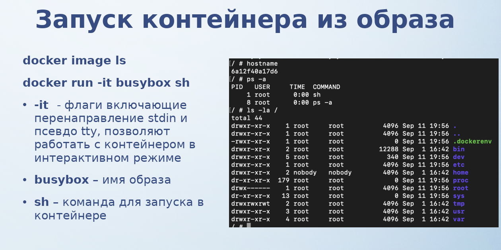

# АРЭ ПО. Лекция 2. Введение в Docker.

[Презентация](L2.pptx)

 

 

__Образ__ - стабильно зафиксированное состояние, которое можно запускать, с одним и тем же набором файлов, версий и всего остального и ожидаем, что всегда один образ работает всегда одинаково. 

__Тэг__ - фиксирование этого состояния, версионирование. Чтобы точно знать, что мы используем конкретное состояние.

 

 

 

 

[Виртуальные файловые системы в Linux: зачем они нужны и как они работают? Часть 1](https://habr.com/ru/companies/otus/articles/446614/)
[Виртуальные файловые системы в Linux: зачем они нужны и как они работают? Часть 2](https://habr.com/ru/companies/otus/articles/447748/)

 

 

 

 

 

 

 

 

 

 

 

 

На примере создал контейнер, создал таблицу в базе. Запустил контейнер заново и этой таблицы нет. Просто пример.

 

 

 

 

 

 

 

 

 

 

 

 

 

 

 

 

 

 

 

 

 

 

 

 

