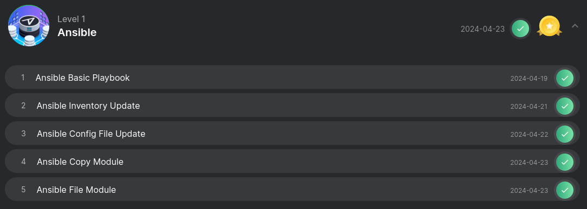
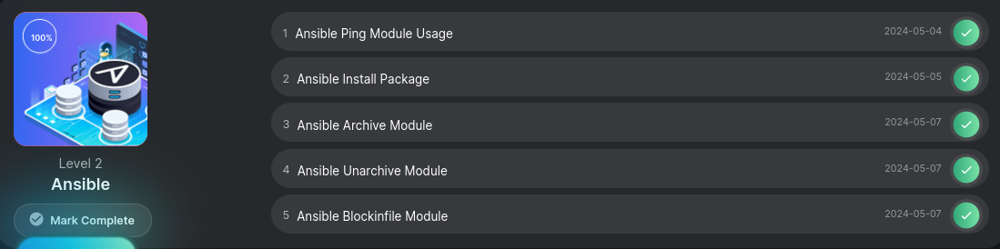

# Решение задач по Ansible 

### Level 1. [+Certificate 🏆](https://engineer.kodekloud.com/certificate-verification/54d4e635-92c5-4900-be5e-f42114b2b1b1)

[🤓  Экзаменционные задачи по Level 1](../Ansible/Level_1/L1-exam.md)

### Level 2.

 - [Ansible Ping Module Usage](../Ansible/Level_2/Ansible%20_ping.md)
 - [Ansible Install Package](../Ansible/Level_2/Ansible%20Install%20Package.md)

