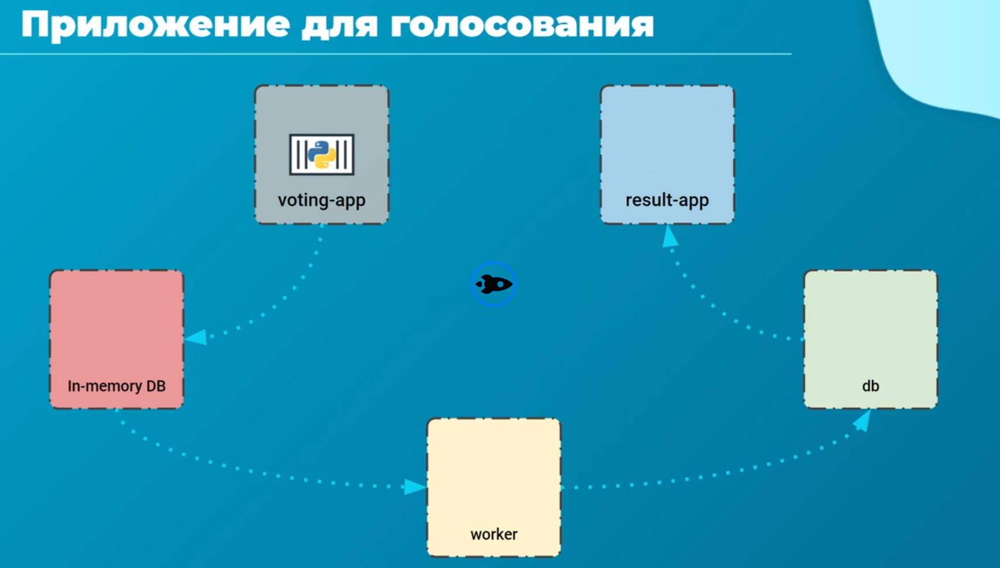
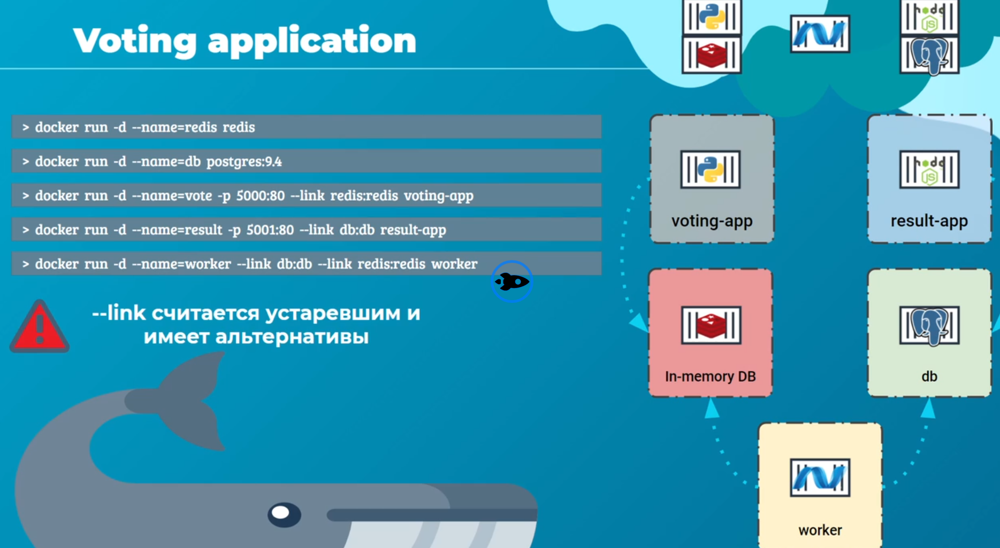
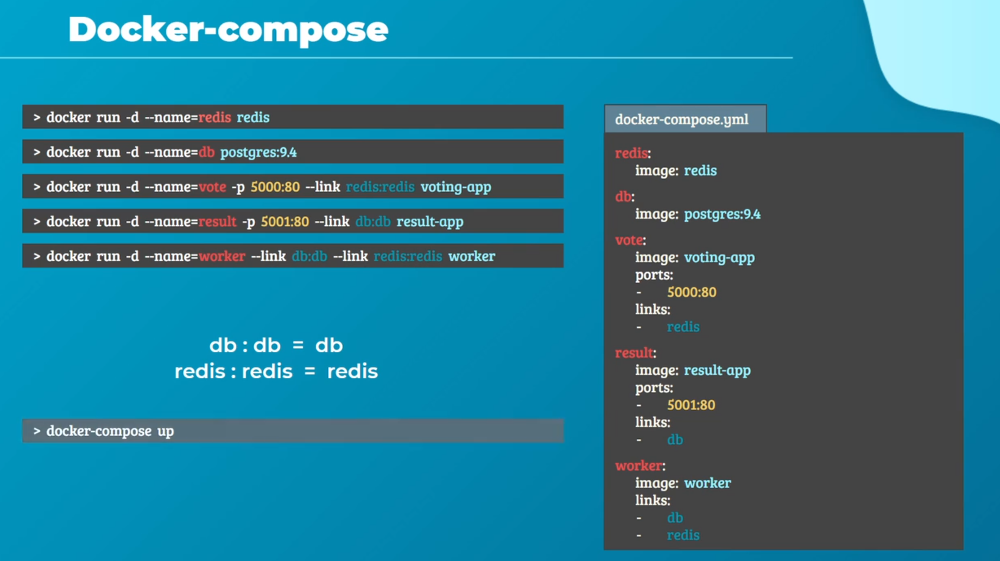
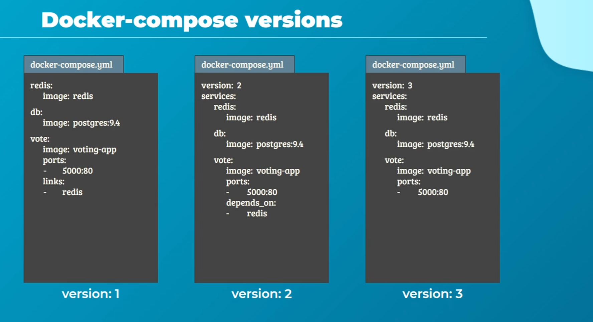

# Docker Compose | Курс rotoro

Рассмотрим приложение от создателей Docker "Приложение для голосования"
- Redis - скорость будет достигаться за счет технологии кэширования вроде Рэдиса
- масштабирование за счет контейнирации
- устойчивость к сбоям за счет микросервисной архитектуры

voting-app разработано на python, предсталяет собой веб страницу в двумя опцями, собаки и кошки

Собираем это приложение на уровне простых команд:

Определились с командами. Теперь создаем docker-compose.yml

Версии Docker Compose файла:

