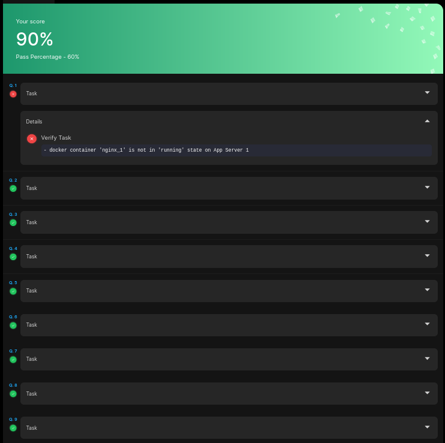

# Level 1. Docker exam

### task1
The Nautilus DevOps team is testing some applications deployment on some of the application servers. They need to deploy a nginx container on Application Server 1. Please complete the task as per details given below:

On Application Server 1 create a container named nginx_1 using image nginx with alpine tag and make sure container is in running state.

__Решение__
```bash
thor@jump_host ~$ ssh tony@stapp01
[tony@stapp01 ~]$ groups
tony wheel docker
[tony@stapp01 ~]$ docker run -d --name nginx_1 nginx:alpine
[tony@stapp01 ~]$ docker ps
CONTAINER ID        IMAGE               COMMAND                  CREATED             STATUS              PORTS               NAMES
9a2aed471b52        nginx:alpine        "/docker-entrypoint.…"   3 seconds ago       Up 2 seconds        80/tcp              nginx_1
```

### task2

The Nautilus team wants to create a debug container on Application Server 1. However, they had some specific requirements related to the CMD. Please complete the task as per details given below:

a. On Application Server 1 create a container named debug_1 using image ubuntu/apache2:latest.

b. Overwrite the default CMD with command sleep 1000.

c. Make sure the container is in running state.

__Решение__

Мы на том же сервере, никуда не подключаемся.
```bash

[tony@stapp01 ~]$ docker run -d --name debug_1 ubuntu/apache2:latest sleep 1000
[tony@stapp01 ~]$ docker ps
CONTAINER ID        IMAGE                   COMMAND             CREATED             STATUS              PORTS               NAMES
757981a876b6        ubuntu/apache2:latest   "sleep 1000"        33 seconds ago      Up 28 seconds       80/tcp              debug_1
```

### task 3

The Nautilus DevOps team has some confidential data present on App Server 1 in Stratos Datacenter. There is a container ubuntu_latest running on the same server. We received a request to copy some of the data from the docker host to the container. Below are more details about the task:


On App Server 1 in Stratos Datacenter copy an encrypted file /tmp/nautilus.txt.gpg from docker host to ubuntu_latest container (running on same server) in /tmp/ location (create this location if doesn't exit). Please do not try to modify this file in any way.

__Решение__

На сервере уже запущен контейнер. В него надо скопировать файл.
```bash
[tony@stapp01 ~]$ docker ps
CONTAINER ID        IMAGE                   COMMAND                CREATED             STATUS              PORTS               NAMES
93b1e860f7e9        ubuntu/apache2:latest   "apache2-foreground"   2 minutes ago       Up 2 minutes        80/tcp              ubuntu_latest


[tony@stapp01 ~]$ docker container cp /tmp/nautilus.txt.gpg ubuntu_latest:/tmp/ | echo $?
0

[tony@stapp01 ~]$ docker exec -it ubuntu_latest /bin/bash
root@93b1e860f7e9:/# ls -la /tmp
total 12
drwxrwxrwt  2 root root 4096 May  5 19:48 .
drwxr-xr-x 17 root root 4096 May  5 19:40 ..
-rw-r--r--  1 root root  105 May  5 19:40 nautilus.txt.gpg
```

### task4
We received a request to copy some of the data from one of the docker containers to the docker host. The container is running on App Server 1 in Stratos Datacenter. Below are more details about the task:

On App Server 1 in Stratos Datacenter copy an encrypted file /tmp/test.txt.gpg from development_3 docker container to the docker host in /tmp location. Please do not try to modify this file in any way.

__Решение__

Теперь нужно скопировать файл с контейнера на хостовую систему:

```bash
[tony@stapp01 ~]$ docker container cp development_3:/tmp/test.txt.gpg /tmp | echo $?
0
[tony@stapp01 ~]$ ls -la /tmp
total 44
drwxrwxrwt 1 root root 4096 May  5 19:54 .
drwxr-xr-x 1 root root 4096 May  5 19:28 ..
drwxrwxrwt 2 root root 4096 May  5 19:28 .ICE-unix
drwxrwxrwt 2 root root 4096 May  5 19:28 .Test-unix
drwxrwxrwt 2 root root 4096 May  5 19:28 .X11-unix
drwxrwxrwt 2 root root 4096 May  5 19:28 .XIM-unix
drwxrwxrwt 2 root root 4096 May  5 19:28 .font-unix
-rwx------ 1 root root  291 Feb  7  2023 ks-script-kzk1nzfd
-rwx------ 1 root root  701 Feb  7  2023 ks-script-l36mq90h
-rw-r--r-- 1 root root  105 May  5 19:40 nautilus.txt.gpg
-rw-r--r-- 1 tony tony   97 May  5 19:52 test.txt.gpg

```

### task5

The Nautilus DevOps team wanted to transfer some docker images from one server to another server so they wanted to save some docker images as tar archives on the docker host itself. Find below the exact requirements:

There is a docker image named nginx:mainline-alpine-slim on App Server 1 in Stratos Datacenter, save this image as nginx.tar archive under /home directory on the same server.

__Решение__

Сохранить надо образ в файл
```bash
[tony@stapp01 ~]$ docker image save nginx:mainline-alpine-slim -o nginx.tar

[tony@stapp01 ~]$ sudo mv nginx.tar /home

[tony@stapp01 ~]$ ls -la /home
total 17888
drwxr-xr-x 1 root    root        4096 May  5 20:01 .
drwxr-xr-x 1 root    root        4096 May  5 19:28 ..
drwx------ 1 ansible ansible     4096 Mar  6  2023 ansible
-rw------- 1 tony    tony    18293248 May  5 20:01 nginx.tar
drwx------ 1 tony    tony        4096 May  5 20:01 tony
```

### task6

The DevOps team is performing some cleanup on all app servers in Stratos DC. They want to clean up some unwanted docker images from these servers, some images might be in use by some docker containers, but those containers are not in use so we need to clean those containers and the images. Below are the images that need to be deleted from Application Server 1:

a. alpine:3.18.4

b. sebp/lighttpd:latest

__Решение__

Нужно удалить образы
```bash

[tony@stapp01 ~]$ docker image ls
REPOSITORY          TAG                    IMAGE ID            CREATED             SIZE
ubuntu/apache2      latest                 92ca8c21b65a        9 days ago          197MB
nginx               alpine                 f4215f6ee683        11 days ago         48.3MB
nginx               mainline-alpine-slim   8c7ba2c9b545        11 days ago         17.1MB
httpd               alpine                 43b6bf3450e2        4 weeks ago         61.6MB
alpine              3.18.4                 8ca4688f4f35        7 months ago        7.33MB
sebp/lighttpd       latest                 fbbc9e0f56f7        21 months ago       9.53MB

[tony@stapp01 ~]$ docker rmi 8ca4688f4f35
Untagged: alpine:3.18.4
Untagged: alpine@sha256:eece025e432126ce23f223450a0326fbebde39cdf496a85d8c016293fc851978
Deleted: sha256:8ca4688f4f356596b5ae539337c9941abc78eda10021d35cbc52659c74d9b443
Deleted: sha256:cc2447e1835a40530975ab80bb1f872fbab0f2a0faecf2ab16fbbb89b3589438

[tony@stapp01 ~]$ docker rmi fbbc9e0f56f7
Error response from daemon: conflict: unable to delete fbbc9e0f56f7 (must be forced) - image is being used by stopped container 649dd14dd865

[tony@stapp01 ~]$ docker ps -a
CONTAINER ID        IMAGE                   COMMAND                  CREATED             STATUS                       PORTS               NAMES
649dd14dd865        sebp/lighttpd:latest    "start.sh"               4 minutes ago       Exited (255) 4 minutes ago                       lighttpd
ac4feba2d212        httpd:alpine            "httpd-foreground"       15 minutes ago      Up 15 minutes                80/tcp              development_3
93b1e860f7e9        ubuntu/apache2:latest   "apache2-foreground"     27 minutes ago      Up 27 minutes                80/tcp              ubuntu_latest
757981a876b6        ubuntu/apache2:latest   "sleep 1000"             28 minutes ago      Exited (0) 12 minutes ago                        debug_1
9a2aed471b52        nginx:alpine            "/docker-entrypoint.…"   36 minutes ago      Exited (0) 33 minutes ago                        nginx_1
[tony@stapp01 ~]$ docker rm 649dd14dd865
649dd14dd865

[tony@stapp01 ~]$ docker rmi sebp/lighttpd:latest
Untagged: sebp/lighttpd:latest
Untagged: sebp/lighttpd@sha256:43d2a1c6d6a2ef85cc1914daa7dbb16776b2ec8bd0e0e7b824caa9bc5079773c
Deleted: sha256:fbbc9e0f56f7dabf00f0053a26635af09476c6baa0fa120f25044273e8d2b39a
Deleted: sha256:b2d27870bbf07b793e052b009e13a0ce96ad28166e5bf3a08f515019309c4297
Deleted: sha256:ee2ee4421825006b870763bfa63dcada0d9959be8ba4e47d9d8bc598e3965cd3
Deleted: sha256:db639f2ad8b2a4866e264776f72d77cd6c0ea14daf0a62d43a88bb57c76cbb55
Deleted: sha256:24302eb7d9085da80f016e7e4ae55417e412fb7e0a8021e95e3b60c67cde557d
```

### Task7

The Nautilus DevOps team is planning to setup/create some docker containers on App Server 1 in Stratos Datacenter, some prerequisites are needs to be done on this server. Find below more details:

Create a new network named mysql-network using the bridge driver. Allocate subnet 182.18.0.1/24, configure Gateway 182.18.0.1.

__Решение__

Создать сеть согласно условиям:
```bash
[tony@stapp01 ~]$ docker network create --driver bridge --subnet 182.18.0.1/24 --gateway 182.18.0.1 mysql-network
21e4c18e637629fc269664ecd17c738b7d21bc0f3dac1efedb81c482e7b3aed1

[tony@stapp01 ~]$ docker network ls
NETWORK ID          NAME                DRIVER              SCOPE
1a3fd5148c10        bridge              bridge              local
4c828d9fdc37        host                host                local
21e4c18e6376        mysql-network       bridge              local
3d9d5530e969        none                null                local

[tony@stapp01 ~]$ docker network inspect mysql-network
[
    {
        "Name": "mysql-network",
        "Id": "21e4c18e637629fc269664ecd17c738b7d21bc0f3dac1efedb81c482e7b3aed1",
        "Created": "2024-05-05T20:18:11.914082539Z",
        "Scope": "local",
        "Driver": "bridge",
        "EnableIPv6": false,
        "IPAM": {
            "Driver": "default",
            "Options": {},
            "Config": [
                {
                    "Subnet": "182.18.0.1/24",
                    "Gateway": "182.18.0.1"
                }
            ]
        },
        "Internal": false,
        "Attachable": false,
        "Ingress": false,
        "ConfigFrom": {
            "Network": ""
        },
        "ConfigOnly": false,
        "Containers": {},
        "Options": {},
        "Labels": {}
    }
]
```

### task8

The Nautilus DevOps team is planning to do some cleanup on App Server 1 in Stratos Datacenter, some old and unused docker networks need to be deleted. Find below more details:

Delete a docker network named php-network from App Server 1 in Stratos Datacenter.

__Решение__

Теперь надо удалить сеть

```bash
[tony@stapp01 ~]$ docker network ls
NETWORK ID          NAME                DRIVER              SCOPE
1a3fd5148c10        bridge              bridge              local
4c828d9fdc37        host                host                local
21e4c18e6376        mysql-network       bridge              local
3d9d5530e969        none                null                local
2890d777c770        php-network         bridge              local
[tony@stapp01 ~]$ docker network --help

Usage:  docker network COMMAND

Manage networks

Commands:
  connect     Connect a container to a network
  create      Create a network
  disconnect  Disconnect a container from a network
  inspect     Display detailed information on one or more networks
  ls          List networks
  prune       Remove all unused networks
  rm          Remove one or more networks

Run 'docker network COMMAND --help' for more information on a command.
[tony@stapp01 ~]$ docker network rm php-network
php-network
[tony@stapp01 ~]$ docker network ls
NETWORK ID          NAME                DRIVER              SCOPE
1a3fd5148c10        bridge              bridge              local
4c828d9fdc37        host                host                local
21e4c18e6376        mysql-network       bridge              local
3d9d5530e969        none                null                local
[tony@stapp01 ~]$ 

```

### task9

There is a static website running within a container named __nautilus__, this container is running on App Server 1. Suddenly, we started facing some issues with the static website on App Server 1. Look into the issue to fix the same, you can find more details below:

a. Container's volume /usr/local/apache2/htdocs is mapped with the host volume /var/www/html.

b. The website should run on host port 8080 on App Server 1 i.e command curl http://localhost:8080/ should work on App Server 1.

__Решение__

Траблшутинг

```bash
Говорят, что контейнер назван Наутилусом, в списках запущенных нет. Сидит в остановленных.
[tony@stapp01 ~]$ docker ps
CONTAINER ID        IMAGE                   COMMAND                CREATED             STATUS              PORTS               NAMES
ac4feba2d212        httpd:alpine            "httpd-foreground"     40 minutes ago      Up 40 minutes       80/tcp              development_3
93b1e860f7e9        ubuntu/apache2:latest   "apache2-foreground"   52 minutes ago      Up 52 minutes       80/tcp              ubuntu_latest

По курлу выводит
[tony@stapp01 ~]$ curl http://localhost:8080/
curl: (7) Failed to connect to localhost port 8080: Connection refused

Ожидаем увидеть это
[tony@stapp01 html]$ cat /var/www/html/index.html 
Welcome to KodeKloud!
[tony@stapp01 html]$ 

Просто стартуем контейнер

[tony@stapp01 html]$ docker start nautilus
nautilus
[tony@stapp01 html]$ docker ps
CONTAINER ID        IMAGE                   COMMAND                CREATED             STATUS              PORTS                  NAMES
74be4d98d0d6        httpd                   "httpd-foreground"     20 minutes ago      Up 5 seconds        0.0.0.0:8080->80/tcp   nautilus
ac4feba2d212        httpd:alpine            "httpd-foreground"     52 minutes ago      Up 52 minutes       80/tcp                 development_3
93b1e860f7e9        ubuntu/apache2:latest   "apache2-foreground"   About an hour ago   Up About an hour    80/tcp                 ubuntu_latest
[tony@stapp01 html]$ curl http://localhost:8080/
Welcome to KodeKloud!
```

## Результаты. 

В первом же задании ошибка. Говорят не запущен контейнер. Ну не знаю, не согласен.


