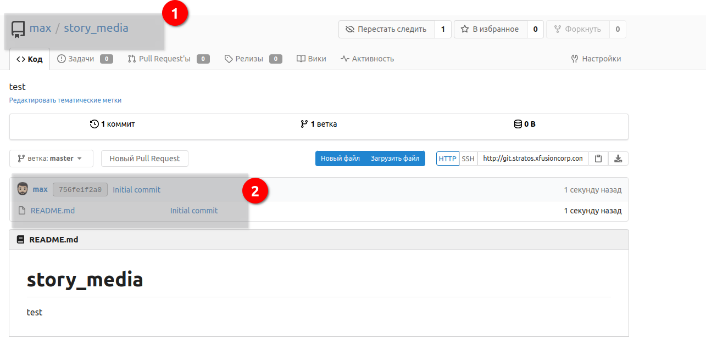

### Manage Git Repositories

A new developer just joined the Nautilus development team and has been assigned a new project for which he needs to create a new repository under his account on Gitea server. Additionally, there is some existing data that need to be added to the repo. Below you can find more details about the task:


Click on the Gitea UI button on the top bar. You should be able to access the Gitea UI. Login to Gitea server using username max and password Max_pass123.


a. Create a new git repository story_media under max user.


b. SSH into storage server using user max and password Max_pass123 and clone this newly created repository under user max home directory i.e /home/max.


c. Copy all files from location /usr/devops to the repository and commit/push your changes to the master branch. The commit message must be "add stories" (must be done in single commit).


d. Create a new branch max_cluster from master.


e. Copy a file story-index-max.txt from location /tmp/stories/ to the repository. This file has a typo, which you can fix by changing the word Mooose to Mouse. Commit and push the changes to the newly created branch. Commit message must be "typo fixed for Mooose" (must be done in single commit).


Note: For these kind of scenarios requiring changes to be done in a web UI, please take screenshots so that you can share it with us for review in case your task is marked incomplete. You may also consider using a screen recording software such as loom.com to record and share your work.

### Решение

Перейти в UI и создать репозиторий:



Подключиться к репозиторию и клонировать его в каталог:

```bash
max $ git clone http://git.stratos.xfusioncorp.com/max/story_media.git /home/max/story_media

max (master)$ cp /usr/devops/* .

max (master)$ git status
On branch master
Your branch is up-to-date with 'origin/master'.
Untracked files:
  (use "git add <file>..." to include in what will be committed)

        frogs-and-ox.txt
        lion-and-mouse.txt

nothing added to commit but untracked files present (use "git add" to track)
max (master)$ 
```

Добавляем в индекс, делаем коммит:
```bash
max (master)$ git add .

max (master)$ git status
On branch master
Your branch is up-to-date with 'origin/master'.
Changes to be committed:
  (use "git reset HEAD <file>..." to unstage)

        new file:   frogs-and-ox.txt
        new file:   lion-and-mouse.txt

max (master)$ git commit -m "add stories"

[master 7bd6355] add stories
 Committer: Linux User <max@ststor01.stratos.xfusioncorp.com>
Your name and email address were configured automatically based
on your username and hostname. Please check that they are accurate.
You can suppress this message by setting them explicitly. Run the
following command and follow the instructions in your editor to edit
your configuration file:

    git config --global --edit

After doing this, you may fix the identity used for this commit with:

    git commit --amend --reset-author

 2 files changed, 42 insertions(+)
 create mode 100644 frogs-and-ox.txt
 create mode 100644 lion-and-mouse.txt
```
Создаем новую ветку и перемещаемся на нее:
```bash
max (master)$ git checkout -b max_cluster

Switched to a new branch 'max_cluster'
max (max_cluster)$ git branch -v
  master      7bd6355 [ahead 1] add stories
* max_cluster 7bd6355 add stories
max (max_cluster)$ 

```
Скопировать файл в рабочую директорию новой ветки, сделать в нем изменения согласно условию, закоммитить и запушить.
```bash
max (max_cluster)$ cp /tmp/stories/story-index-max.txt .
max (max_cluster)$ vi story-index-max.txt
max (max_cluster)$ git add story-index-max.txt 
max (max_cluster)$ git commit -m "typo fixed for Mooose"
max (max_cluster)$ git push origin -all
```
