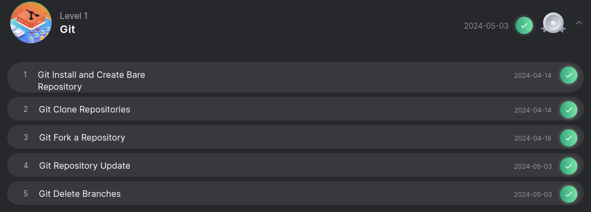

# Решение задач по Git

### Level 1. [Certificate](https://engineer.kodekloud.com/certificate-verification/db91180e-eefc-41bb-8cbe-bbd580e31acb)

### Level 1

- [Level 1 | Git Install and Create Bare Repository](/Kodekloud/Git/Level_1/Level_1_task1.md)
- [Level 1 | Git Clone Repositories](/Kodekloud/Git/Level_1/Level_1_task2.md)
- [Level 1 | Git Fork a Repository](/Kodekloud/Git/Level_1/Level_1_task3.md)
- [Level 1 | Git Repository Update](/Kodekloud/Git/Level_1/Level_1_task4.md)
- [Level 1 | Git Delete Branches](/Kodekloud/Git/Level_1/Level_1_task5.md)

### Level 2

- [Level 2 | Git Install and Create Repository](/Kodekloud/Git/Level_2/Level_2_task1.md)
- [Level 2 | Git Create Branches](/Kodekloud/Git/Level_2/Level_2_task2.md)
- [Level 2 | Git Merge Branches](/Kodekloud/Git/Level_2/Level_2_task3.md)
- [Level 2 | Git Manage Remotes](/Kodekloud/Git/Level_2/Level_2_task4.md)
- [Level 2 | Git Revert Some Changes](/Kodekloud/Git/Level_2/Level_2_task5.md)

### Level 3

- [Level 3 | Git Cherry Pick](/Kodekloud/Git/Level_3/Level_3_task1.md)
- [Level 3 | Manage Git Pull Requests](/Kodekloud/Git/Level_3/Level_3_task2.md)
- [Level 3 | Git hard reset](/Kodekloud/Git/Level_3/Level_3_task3.md)
- [Level 3 | Git Clean](/Kodekloud/Git/Level_3/Level_3_task4.md)
- [Level 3 | Git Stash](/Kodekloud/Git/Level_3/Level_3_task5.md)
