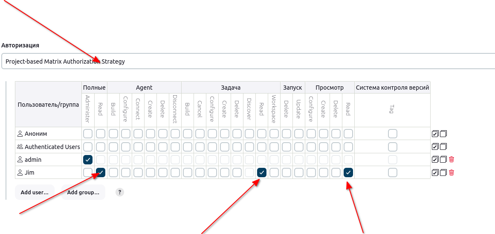

# Jenkins Create Users

The Nautilus team is planning to use Jenkins for some of their CI/CD pipelines. DevOps team has just installed a fresh Jenkins server and they are configuring it further to be available for use.

Click on the Jenkins button on the top bar to access the Jenkins UI. Login using username admin and password Adm!n321.

It has only a sample job for now. A new developer has joined the Nautilus application development team and they want this user to be added to the Jenkins server as per the details mentioned below:

1. Create a jenkins user named jim with dCV3szSGNA password, their full name should be Jim (it is case sensitive).

2. Using Project-based Matrix Authorization Strategy assign overall read permission to jim user.

3. Remember to remove all permissions for Anonymous users (if given) and make sure admin user has overall Administer permissions.

4. There is one existing job, make sure jim only has read permissions to that job (we are not worried about other permissions like Agent, SCM, etc.).

Note:

1. You might need to install some plugins and restart Jenkins service. So, we recommend clicking on Restart Jenkins when installation is complete and no jobs are running on plugin installation/update page i.e update centre. Also, in case Jenkins UI gets stuck when Jenkins service restarts in the back end, please make sure to refresh the UI page.

2. Do not immediately click on Finish button if you have restarted the Jenkins service, please wait for Jenkins login page to come back before finishing your task.

3. For these kind of scenarios that required changes to be done from a web UI, please take screenshots of your work so that you can share the same with us for review purpose (in case your task is marked incomplete or failed). You may also consider using a screen recording software such as loom.com to record and share your work.

### Решение

Пользователя создал. Для настройки следующего пункта необходимо установить плагин __Matrix Authorization Strategy Version 3.2.2.__ Устанавливаем и перезапускаем Jenkins.

Предоставил пользователю права на чтение с помощью плагина, найти не просто, на вкладке Security, Авторизация. Нужно удалить у анонимных пользователей все права и тогда точечно можно навешивать отдельным пользователям.

Зайдем под джимом и посмотрим что он может. Видит задачу, но не более, не знаю, достаточно ему этого будет по условию или нет...

зачтено задание. Верно!
