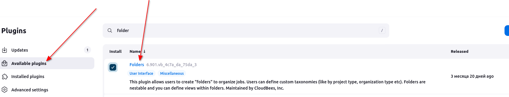
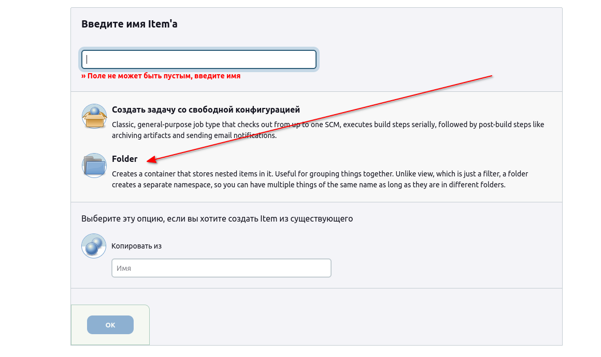
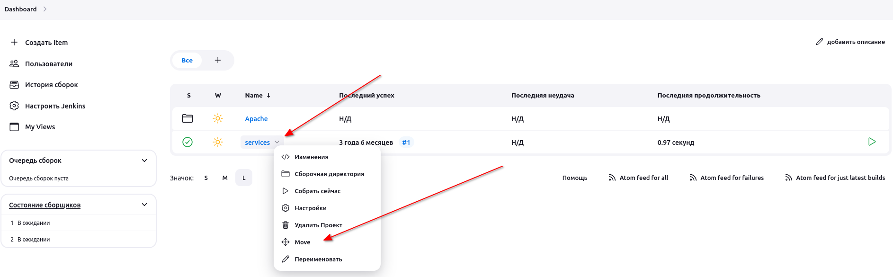

# Jenkins Folders

The DevOps team of xFusionCorp Industries is planning to create a number of Jenkins jobs for different tasks. To easily manage the jobs within Jenkins UI they decided to create different Folders for all Jenkins jobs based on usage/nature of these jobs. Based on the requirements shared below please perform the below mentioned task:

Click on the Jenkins button on the top bar to access the Jenkins UI. Login using username admin and password Adm!n321.

1. There are already two jobs httpd-php and services.

2. Create a new folder called Apache under Jenkins UI.

3. Move the above mentioned two jobs under Apache folder.

Note:
1. You might need to install some plugins and restart Jenkins service. So, we recommend clicking on Restart Jenkins when installation is complete and no jobs are running on plugin installation/update page i.e update centre. Also, Jenkins UI sometimes gets stuck when Jenkins service restarts in the back end. In this case, please make sure to refresh the UI page.

2. For these kind of scenarios requiring changes to be done in a web UI, please take screenshots so that you can share it with us for review in case your task is marked incomplete. You may also consider using a screen recording software such as loom.com to record and share your work.

# Решение

Уже создано 2 джобы, создать новую папку Apache. Похоже я не могу создать папку, пока не установлю какой-то плагин. 
Похоже этот.

Устанавливаем, перепускаем jenkins.

Появилась менюшка.

Создали. Двигаем джобы.

Я еще сделал через копирование. И тогда этой менюхи Move небыло, для успешного завершения надо было бы удалить эти джобы корневые. Но не стал. Сделал по плану.

Успех!
