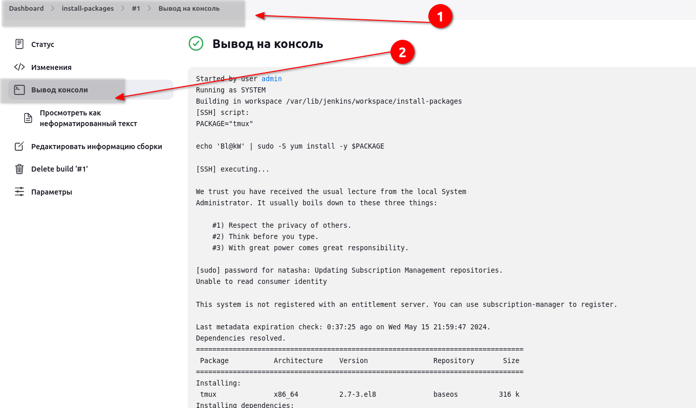

# Jenkins Install Packages

Some new requirements have come up to install and configure some packages on the Nautilus infrastructure under Stratos Datacenter. The Nautilus DevOps team installed and configured a new Jenkins server so they wanted to create a Jenkins job to automate this task. Find below more details and complete the task accordingly:


Click on the Jenkins button on the top bar to access the Jenkins UI. Login using username admin and Adm!n321 password.

Create a Jenkins job named install-packages and configure it to accomplish below given tasks.

- Add a string parameter named PACKAGE.
- Configure it to install a package on the storage server in Stratos Datacenter provided to the $PACKAGE parameter.

Note:

1. You might need to install some plugins and restart Jenkins service. So, we recommend clicking on Restart Jenkins when installation is complete and no jobs are running on plugin installation/update page i.e update centre. Also some times Jenkins UI gets stuck when Jenkins service restarts in the back end so in such case please make sure to refresh the UI page.

2. Make sure Jenkins job passes even on repetitive runs as validation may try to build the job multiple times.

3. For these kind of scenarios requiring changes to be done in a web UI, please take screenshots so that you can share it with us for review in case your task is marked incomplete. You may also consider using a screen recording software such as loom.com to record and share your work.

### Решение

Подключаемся, не знаю, что надо установить. Прибегаем к помощи Гугла. Говорят надо установить SSH плагины. Ставим...


Перезагрузили. Далее похоже нужно добавить credentials.


Пока что добавлю по связке логин/пароль, потом буду смотреть, как ключ прописать.


Далее нужно добавить удаленный хост.


Жмем внизу сохранить!!!

Создаем item


Прописываем согласно условию.


Шаги сборки


Жмем сохранить.

Указываем пакет. Жмем собрать!


Можно посмотреть консоль.



На сервер пакет собрался!
```bash
[natasha@ststor01 ~]$ rpm -qa | grep tmux
tmux-2.7-3.el8.x86_64
```

```bash
Started by user admin
Running as SYSTEM
Building in workspace /var/lib/jenkins/workspace/install-packages
[SSH] script:
PACKAGE="tmux"

echo 'Bl@kW' | sudo -S yum install -y $PACKAGE

[SSH] executing...

We trust you have received the usual lecture from the local System
Administrator. It usually boils down to these three things:

    #1) Respect the privacy of others.
    #2) Think before you type.
    #3) With great power comes great responsibility.

[sudo] password for natasha: Updating Subscription Management repositories.
Unable to read consumer identity

This system is not registered with an entitlement server. You can use subscription-manager to register.

Last metadata expiration check: 0:37:25 ago on Wed May 15 21:59:47 2024.
Dependencies resolved.
================================================================================
 Package           Architecture    Version                Repository       Size
================================================================================
Installing:
 tmux              x86_64          2.7-3.el8              baseos          316 k
Installing dependencies:
 libevent          x86_64          2.1.8-5.el8            baseos          253 k

Transaction Summary
================================================================================
Install  2 Packages

Total download size: 570 k
Installed size: 1.6 M
Downloading Packages:
(1/2): libevent-2.1.8-5.el8.x86_64.rpm          3.1 MB/s | 253 kB     00:00    
(2/2): tmux-2.7-3.el8.x86_64.rpm                3.7 MB/s | 316 kB     00:00    
--------------------------------------------------------------------------------
Total                                           1.7 MB/s | 570 kB     00:00     
Running transaction check
Transaction check succeeded.
Running transaction test
Transaction test succeeded.
Running transaction
  Preparing        :                                                        1/1 
  Installing       : libevent-2.1.8-5.el8.x86_64                            1/2 
  Installing       : tmux-2.7-3.el8.x86_64                                  2/2 
  Running scriptlet: tmux-2.7-3.el8.x86_64                                  2/2 
  Verifying        : libevent-2.1.8-5.el8.x86_64                            1/2 
  Verifying        : tmux-2.7-3.el8.x86_64                                  2/2 
Installed products updated.

Installed:
  libevent-2.1.8-5.el8.x86_64               tmux-2.7-3.el8.x86_64              

Complete!

[SSH] completed
[SSH] exit-status: 0

Finished: SUCCESS
```
