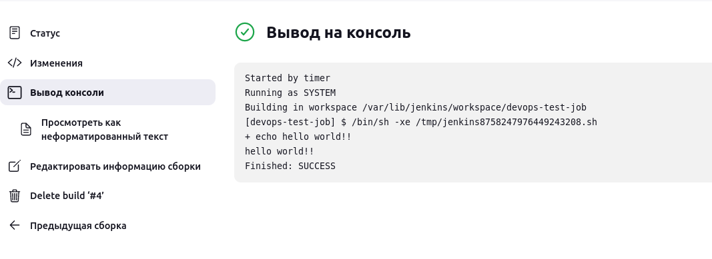
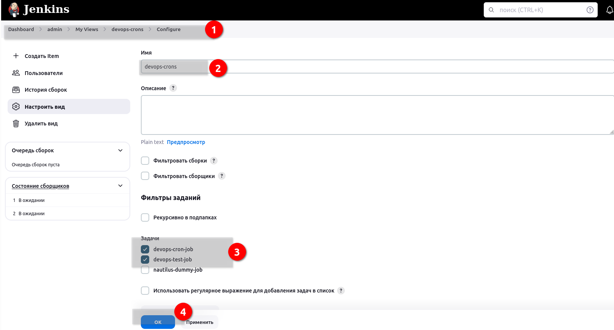

# Jenkins Installation
The DevOps team of xFusionCorp Industries is planning to create a number of Jenkins jobs for different tasks. So to easily manage the jobs within Jenkins UI they decided to create different views for all Jenkins jobs based on usage/nature of these jobs, - for example devops-crons view for all cron jobs. Based on the requirements shared below please perform the below mentioned task:

Click on the Jenkins button on the top bar to access the Jenkins UI. Login using username admin and password Adm!n321.

1. Create a Jenkins job named devops-test-job.

2. Configure this job to run a simple bash command i.e echo "hello world!!".

3. Create a view named devops-crons (it must be a global view of type List View) and make sure devops-test-job and devops-cron-job (which is already present on Jenkins) jobs are listed under this new view.

4. Schedule this newly created job to build periodically at every minute i.e * * * * * (please make sure to use the cron expression exactly same how it is mentioned here)

5. Make sure the job builds successfully.

Note:

1. You might need to install some plugins and restart Jenkins service. So, we recommend clicking on Restart Jenkins when installation is complete and no jobs are running on plugin installation/update page i.e update centre. Also, Jenkins UI sometimes gets stuck when Jenkins service restarts in the back end. In this case please make sure to refresh the UI page.

2. For these kind of scenarios requiring changes to be done in a web UI, please take screenshots so that you can share it with us for review in case your task is marked incomplete. You may also consider using a screen recording software such as loom.com to record and share your work.

### Решение

Нажимаем Build или собрать сейчас. Смотрим консоль.

Создать новую вьюху и наполнить джобами.

