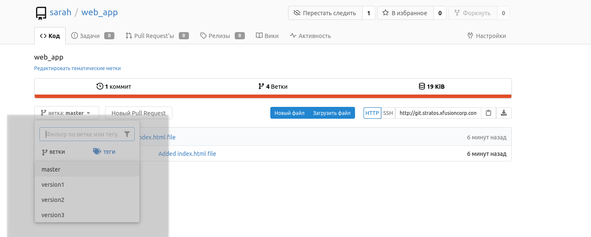
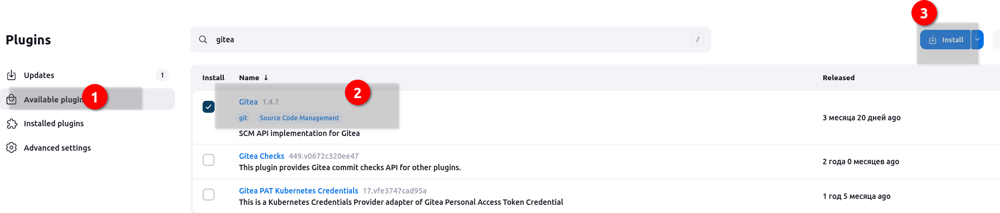
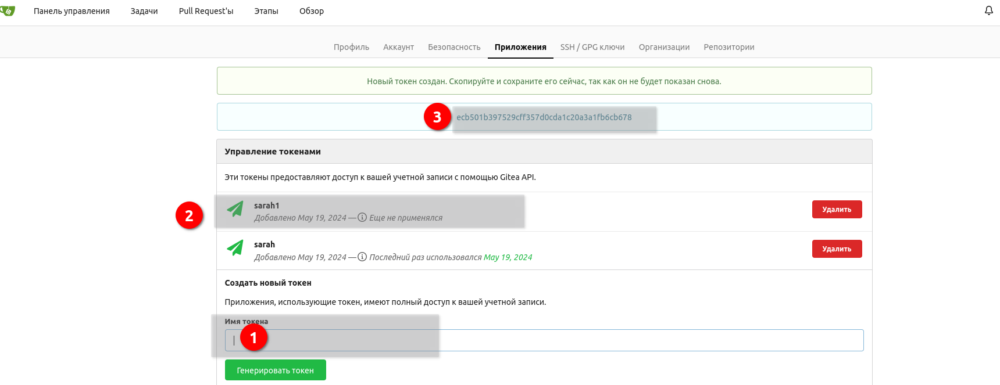
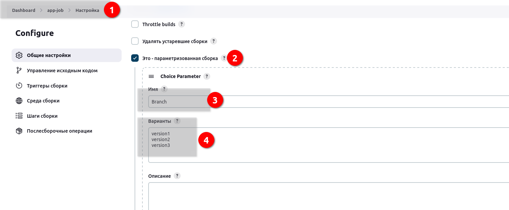
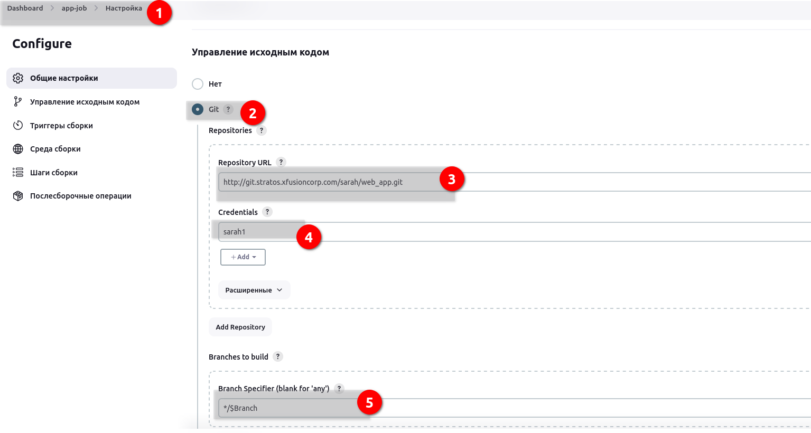
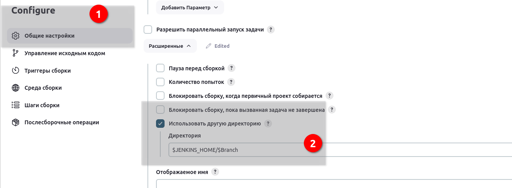
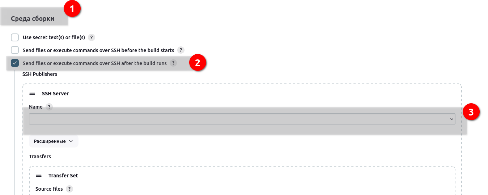
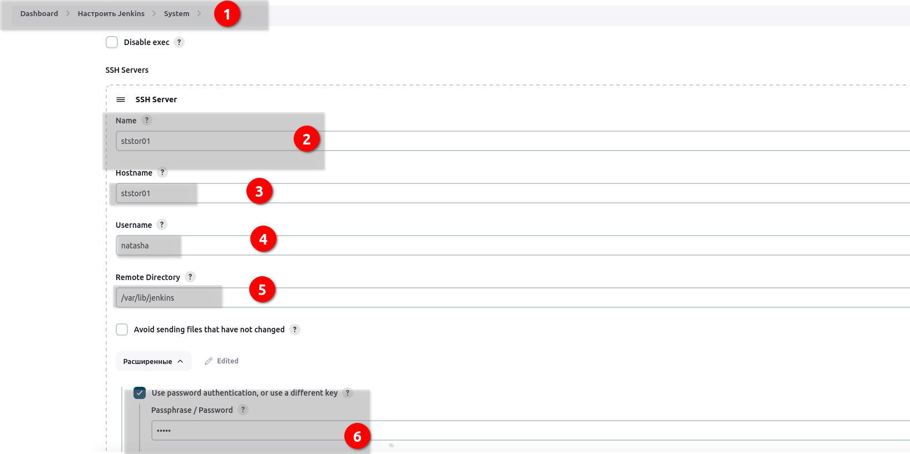
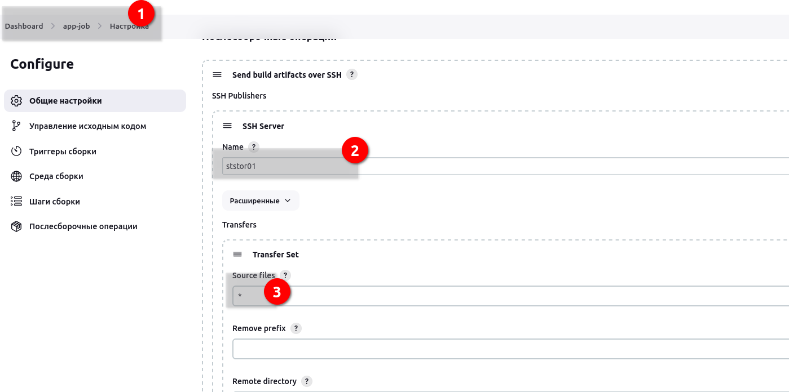

# Jenkins Workspaces

Some developers are working on a common repository where they are testing some features for an application. They are having three branches (excluding the master branch) in this repository where they are adding changes related to these different features. They want to test these changes on Stratos DC app servers so they need a Jenkins job using which they can deploy these different branches as per requirements. Configure a Jenkins job accordingly.


Click on the Jenkins button on the top bar to access the Jenkins UI. Login using username admin and password Adm!n321.

Similarly, click on Gitea button to access the Gitea page. Login to Gitea server using username sarah and password Sarah_pass123.

 - There is a Git repository named web_app on Gitea where developers are pushing their changes. It has three branches version1, version2 and version3 (excluding the master branch). You need not to make any changes in the repository.

- Create a Jenkins job named app-job.

- Configure this job to have a choice parameter named Branch with choices as given below:

- version1

- version2

- version3

- Configure the job to fetch changes from above mentioned Git repository and make sure it should fetches the changes from the respective branch which you are passing as a choice in the choice parameter while building the job. For example if you choose version1 then it must fetch and deploy the changes from branch version1.

- Configure this job to use custom workspace rather than a default workspace and custom workspace directory should be created under /var/lib/jenkins (for example /var/lib/jenkins/version1) location rather than under any sub-directory etc. The job should use a workspace as per the value you will pass for Branch parameter while building the job. For example if you choose version1 while building the job then it should create a workspace directory called version1 and should fetch Git repository etc within that directory only.

- Configure the job to deploy code (fetched from Git repository) on storage server (in Stratos DC) under /var/www/html directory. Since its a shared volume.

- You can access the website by clicking on App button.


### Решение

На Gitea сервере 3 ветки. Подключился посмотрел.
Нужно как то забирать оттуда файлы из веток.



Jenkins. Нужно установить 3 плагина: 
- gitea (если установим можно будет указать в авторизационных данных токен gitea, если не ставить - то по связке логин пароль)
- ssh
- Publish Over SSH



Jenkins. Настроить credentials для sarah для подключения к серверу gitea. Предварительно генерируем токен для подключения.



и прописываем его в менюшке кредентиалс. Там все просто.

Jenkins. Создаем джобу. Стандартную

Указываем, что это параметризованная сборка



Конфигурирем через GIT, указав URL репозитория, авторизационные данные пользователя, и параметр, которые указали ранее.



Указываем workspace directory:




Далее в пункте __среда сборки__ нужно указать сервер куда будет закидывать полученные из репо файлы. Там сервер нужно выбрать из выпадающего списка. Его нужно заранее прописать. Ищем менюху и потом возращаемся. Задание пока сохраняем.



Переходим в settings, внизу находим ssh сервера и прописываем:



внизу будет тест. Он не проходит по ошибке

`jenkins.plugins.publish_over.BapPublisherException: Failed to connect and initialize SSH connection. Message: [Failed to change to remote directory [/var/lib/jenkins]]`

Тест не проходил, потому что была указана неверная директория. Смотреть задание, указал `/var/www/html`

Теперь смело в джобе указываем 



Запускаем и проверяем.

#### Лог выполнения. Ниже разбор действий jenkins с репозиторием.

Из лога становится понятно, зачем делать отдельный workspace для файлов из репозиториев. Также посмотреть, при каких настройках, условиях указанная директория может быть очищена.

```bash
Started by user admin
Running as SYSTEM
Building in workspace /var/lib/jenkins/version3
The recommended git tool is: NONE
using credential sarah1
Cloning the remote Git repository
Cloning repository http://git.stratos.xfusioncorp.com/sarah/web_app.git
 > git init /var/lib/jenkins/version3 # timeout=10
Fetching upstream changes from http://git.stratos.xfusioncorp.com/sarah/web_app.git
 > git --version # timeout=10
 > git --version # 'git version 2.25.1'
using GIT_ASKPASS to set credentials sarah1
 > git fetch --tags --force --progress -- http://git.stratos.xfusioncorp.com/sarah/web_app.git +refs/heads/*:refs/remotes/origin/* # timeout=10
 > git config remote.origin.url http://git.stratos.xfusioncorp.com/sarah/web_app.git # timeout=10
 > git config --add remote.origin.fetch +refs/heads/*:refs/remotes/origin/* # timeout=10
Avoid second fetch
 > git rev-parse refs/remotes/origin/version3^{commit} # timeout=10
Checking out Revision 28b03cfd32c857e65b82bda1513f1936c0a4384e (refs/remotes/origin/version3)
 > git config core.sparsecheckout # timeout=10
 > git checkout -f 28b03cfd32c857e65b82bda1513f1936c0a4384e # timeout=10
Commit message: "Added index.html file to branch version3"
First time build. Skipping changelog.
SSH: Connecting from host [jenkins.stratos.xfusioncorp.com]
SSH: Connecting with configuration [ststor01] ...
SSH: Disconnecting configuration [ststor01] ...
SSH: Transferred 1 file(s)
[Gitea] do not publish assets due to source being no GiteaSCMSource
Finished: SUCCESS

```

Давайте разберем эти команды Git по порядку:

    git init /var/lib/jenkins/version3 # timeout=10
        Инициализирует новый Git репозиторий в директории /var/lib/jenkins/version3.
        timeout=10 указывает таймаут в 10 секунд для этой операции.

    git --version # timeout=10
        Выводит версию установленного Git. Здесь версия 2.25.1.

    git fetch --tags --force --progress -- http://git.stratos.xfusioncorp.com/sarah/web_app.git +refs/heads/*:refs/remotes/origin/* # timeout=10
        Скачивает изменения из удаленного репозитория http://git.stratos.xfusioncorp.com/sarah/web_app.git не сливая их с локальным репозиторием.
        Флаги: --tags - скачивает все теги, --force перезаписывает локальные ветки, --progress показывает прогресс.
        +refs/heads/*:refs/remotes/origin/* скачивает все ветки из refs/heads в refs/remotes/origin.

    git config remote.origin.url http://git.stratos.xfusioncorp.com/sarah/web_app.git # timeout=10
        Устанавливает URL удаленного репозитория origin.

    git config --add remote.origin.fetch +refs/heads/*:refs/remotes/origin/* # timeout=10
        Добавляет спецификацию refspec для скачивания всех веток из удаленного репозитория origin.

    git rev-parse refs/remotes/origin/version3^{commit} # timeout=10
        Выводит SHA-1 хеш коммита, на который указывает refs/remotes/origin/version3.

    git config core.sparsecheckout # timeout=10
        Проверяет включен ли режим sparse-checkout.

    git checkout -f 28b03cfd32c857e65b82bda1513f1936c0a4384e # timeout=10
        Переключается на коммит с указанным хешем, флаг -f указывает на принудительное переключение, отбрасывая локальные изменения.

В целом, эти команды инициализируют репозиторий, скачивают изменения из удаленного репозитория web_app.git, переключаются на коммит из ветки version3 и настраивают удаленный репозиторий origin.

#### Режим sparse-checkout 

Режим sparse-checkout в Git позволяет частично checkoutить репозиторий, то есть получить на диск только определенное подмножество файлов и директорий вместо всего содержимого репозитория. Это может быть полезно для экономии дискового пространства и ускорения операций в больших репозиториях, когда вам нужна только часть файлов.

Когда режим sparse-checkout включен, Git позволяет указать, какие файлы и директории должны быть checkoutнуты на диск. Это указывается с помощью шаблонов путей в файле .git/info/sparse-checkout.

Вот как обычно используется sparse-checkout:

    Включение режима sparse-checkout:

git config core.sparsecheckout true

Указание нужных файлов/директорий в .git/info/sparse-checkout, например:

echo "dir1/" >> .git/info/sparse-checkout
echo "dir2/file1.txt" >> .git/info/sparse-checkout

Обновление рабочей директории:

    git read-tree -mu HEAD

После этого в рабочей директории будут присутствовать только указанные файлы и директории, даже если в репозитории есть другие файлы.

Команда git config core.sparsecheckout без аргументов просто проверяет, включен ли режим sparse-checkout в данном репозитории. Если выводится true, то режим включен, если пусто - выключен.
