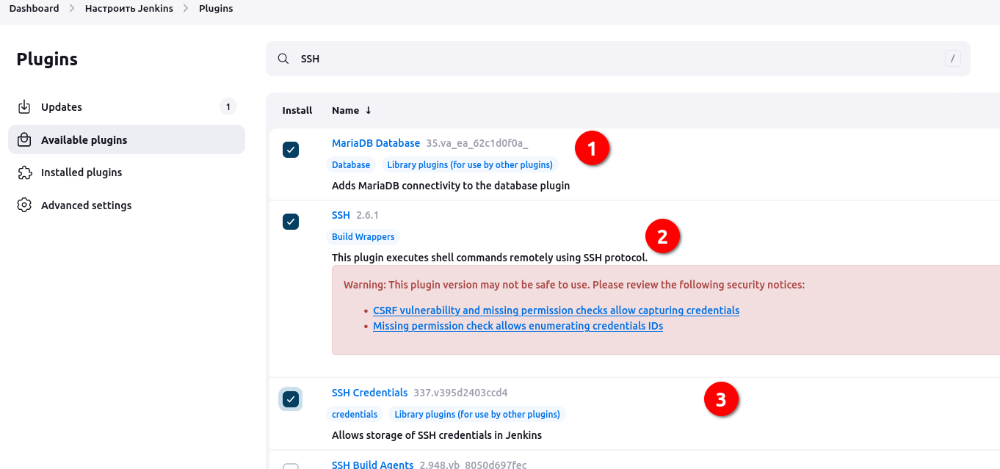
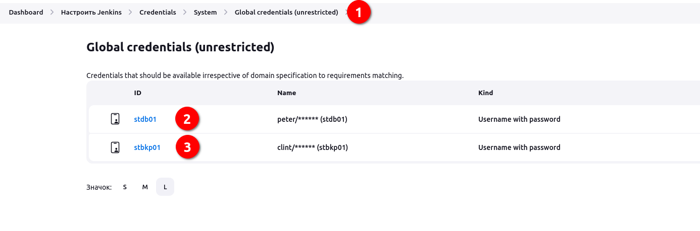
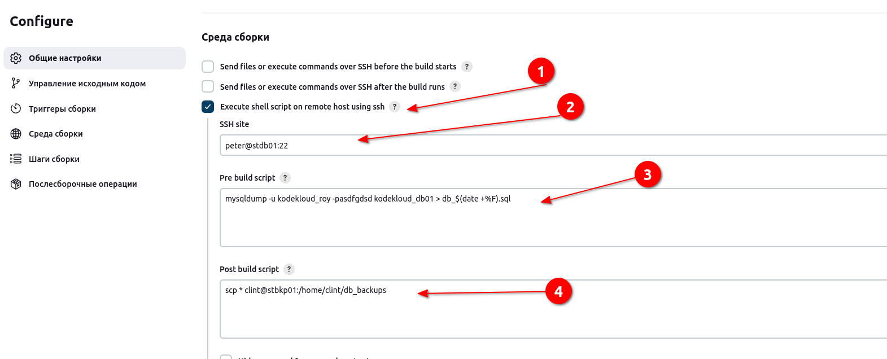
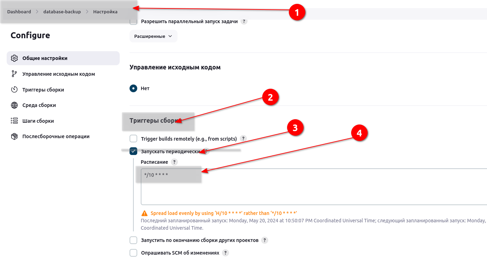

# Jenkins Database Backup Job

There is a requirement to create a Jenkins job to automate the database backup. Below you can find more details to accomplish this task:


Click on the Jenkins button on the top bar to access the Jenkins UI. Login using username admin and password Adm!n321.

- Create a Jenkins job named database-backup.

- Configure it to take a database dump of the kodekloud_db01 database present on the Database server in Stratos Datacenter, the database user is kodekloud_roy and password is asdfgdsd.

- The dump should be named in db_$(date +%F).sql format, where date +%F is the current date.

- Copy the db_$(date +%F).sql dump to the Backup Server under location /home/clint/db_backups.

- Further, schedule this job to run periodically at */10 * * * * (please use this exact schedule format).

Note:

- You might need to install some plugins and restart Jenkins service. So, we recommend clicking on Restart Jenkins when installation is complete and no jobs are running on plugin installation/update page i.e update centre. Also, Jenkins UI sometimes gets stuck when Jenkins service restarts in the back end. In this case please make sure to refresh the UI page.

- Please make sure to define you cron expression like this */10 * * * * (this is just an example to run job every 10 minutes).

- For these kind of scenarios requiring changes to be done in a web UI, please take screenshots so that you can share it with us for review in case your task is marked incomplete. You may also consider using a screen recording software such as loom.com to record and share your work.


### Решение

Подключаюсь на сервер с БД, смотрю открытые порты:
```bash
[root@stdb01 ~]# ss -atlpn
State      Recv-Q     Send-Q          Local Address:Port            Peer Address:Port     Process                               
LISTEN     0          4096               127.0.0.11:35173                0.0.0.0:*                                              
LISTEN     0          128                   0.0.0.0:22                   0.0.0.0:*         users:(("sshd",pid=550,fd=3))        
LISTEN     0          80                          *:3306                       *:*         users:(("mysqld",pid=887,fd=21))     
LISTEN     0          128                      [::]:22                      [::]:*         users:(("sshd",pid=550,fd=4)) 
```
Порт 3306 слушается...

Также в списках сервисов висит:
`mariadb.service                                   loaded active     running   MariaDB 10.3 database server`

Попробуем поставить какой-нибудь плагин jenkins и подключиться.



При попытке добавить подключение к серверу БД происходит ошибка. Не знаю, может по условию так не предусмотрено...

`Caused: java.sql.SQLException: Cannot create PoolableConnectionFactory (Host 'jenkins.devops-jenkins-database-backup-v2_db_net' is not allowed to connect to this MariaDB server)`

На сервере к базе могу подключиться, посмотреть:

`mysql -u kodekloud_roy -pasdfgdsd kodekloud_db01`
`show schemas;`
`use kodekloud_db01`
`show tables;`
`SHOW VARIABLES LIKE 'port';`

Получается они предлагают зашить операции в shell скрипт по ssh и с jenkins выполнить скрипт на stdb01 сервере и потом скопировать дамп на stbkb01. Пропишу в кредентиалс двух пользователей, пароли логины известны.



Создаем джобу, прописываем:
`mysqldump -u kodekloud_roy -pasdfgdsd -h 172.16.239.10 -P 3306 kodekloud_db01 > db_$(date +%F).sql`

Вообщем убил час. Ничего не получается, только в лоб. Генерируем ключи ssh на одном сервере и прокидываем на другой, чтобы джоба не ругалась.

```bash
[peter@stdb01 ~]$ ssh-keygen -q
Enter file in which to save the key (/home/peter/.ssh/id_rsa): 
Enter passphrase (empty for no passphrase): 
Enter same passphrase again: 

[peter@stdb01 ~]$ ssh-copy-id clint@stbkp01
/usr/bin/ssh-copy-id: INFO: Source of key(s) to be installed: "/home/peter/.ssh/id_rsa.pub"
The authenticity of host 'stbkp01 (172.17.0.6)' can't be established.
ECDSA key fingerprint is SHA256:9Q4gltOjlkpMl2ebQEXLNrNOj83ddq5uCK+HHFP4Q2M.
Are you sure you want to continue connecting (yes/no/[fingerprint])? yes
/usr/bin/ssh-copy-id: INFO: attempting to log in with the new key(s), to filter out any that are already installed
/usr/bin/ssh-copy-id: INFO: 1 key(s) remain to be installed -- if you are prompted now it is to install the new keys
clint@stbkp01's password: 

Number of key(s) added: 1

Now try logging into the machine, with:   "ssh 'clint@stbkp01'"
and check to make sure that only the key(s) you wanted were added.

[peter@stdb01 ~]$ ls
```

Джоба простая





__Cуть еще раз__

- Задание подключается к ранее созданному серверу SSH, с прописанными данными для аутентификации.
- выполняет скрипт и дамп остается лежать на том сервере DB, где скрипт выполнялся. На дженкинс не льется, да и зачем.
- для того чтобы копировать его на сервер backup нужно использоваться SCP, для исключения запроса пароля, предварительно прокидиваем с одного сервера на другой ssh ключик, руками. Так то я немного неприятно удивлен.
- добавить периодичность.

Две команды в джобе:

`mysqldump -u kodekloud_roy -pasdfgdsd kodekloud_db01 > db_$(date +%F).sql`

`scp * clint@stbkp01:/home/clint/db_backups`

Лог джобы:

```bash
Started by user admin
Running as SYSTEM
Building in workspace /var/lib/jenkins/workspace/database-backup
[SSH] executing pre build script:

mysqldump -u kodekloud_roy -pasdfgdsd kodekloud_db01 > db_$(date +%F).sql

[SSH] completed
[SSH] exit-status: 0

[SSH] executing post build script:

scp * clint@stbkp01:/home/clint/db_backups

[SSH] completed
[SSH] exit-status: 0

Finished: SUCCESS

```


