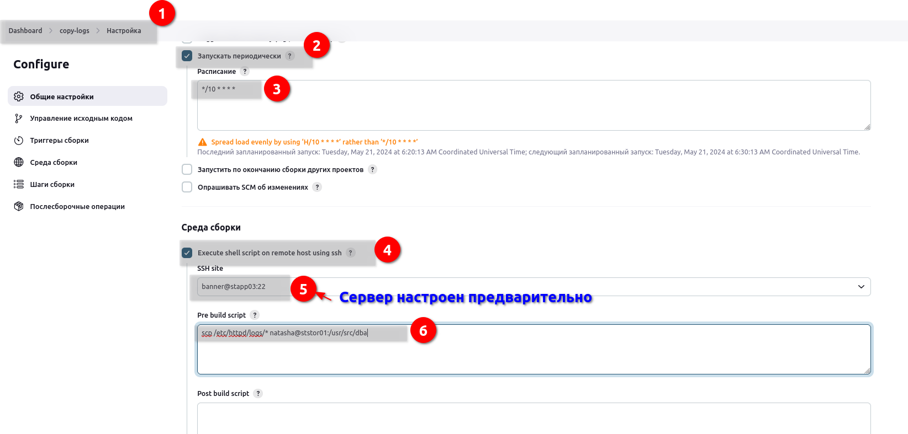

# Jenkins Scheduled Jobs

The devops team of xFusionCorp Industries is working on to setup centralised logging management system to maintain and analyse server logs easily. Since it will take some time to implement, they wanted to gather some server logs on a regular basis. At least one of the app servers is having issues with the Apache server. The team needs Apache logs so that they can identify and troubleshoot the issues easily if they arise. So they decided to create a Jenkins job to collect logs from the server. Please create/configure a Jenkins job as per details mentioned below:


Click on the Jenkins button on the top bar to access the Jenkins UI. Login using username admin and password Adm!n321

1. Create a Jenkins jobs named copy-logs.

2. Configure it to periodically build every 12 minutes to copy the Apache logs (both access_log and error_logs) from App Server 3 (from default logs location) to location /usr/src/dba on Storage Server.

Note:

1. You might need to install some plugins and restart Jenkins service. So, we recommend clicking on Restart Jenkins when installation is complete and no jobs are running on plugin installation/update page i.e update centre. Also, Jenkins UI sometimes gets stuck when Jenkins service restarts in the back end. In this case please make sure to refresh the UI page.

2. Please make sure to define you cron expression like this */10 * * * * (this is just an example to run job every 10 minutes).

3. For these kind of scenarios requiring changes to be done in a web UI, please take screenshots so that you can share it with us for review in case your task is marked incomplete. You may also consider using a screen recording software such as loom.com to record and share your work.


### Решение

Jenkins UI. Устанавливаем плагины:
- SSH
- Jenkins Scheduled Jobs

Нужно используя jenkins подключиться к app3 серверу и через командный shell скопировать файлы логов на сервер Storage.

Для беспарольного доступа, предварительно прокину ключи SSH.

```bash
[banner@stapp03 .ssh]$ ssh-keygen -q
Enter file in which to save the key (/home/banner/.ssh/id_rsa): 
Enter passphrase (empty for no passphrase): 
Enter same passphrase again: 
[banner@stapp03 .ssh]$ ssh-copy-id natasha@ststor01
```

Ключ проброшен. Плагины установлены. Создаем ssh сервер для отражения в джобе и формируем для него авторизационные данные.

Создаем задание, ключевое:

`scp /etc/httpd/logs/* natasha@ststor01:/usr/src/dba`



Итоговый лог:

```bash
Started by user admin
Running as SYSTEM
Building in workspace /var/lib/jenkins/workspace/copy-logs
[SSH] executing pre build script:

scp /etc/httpd/logs/* natasha@ststor01:/usr/src/dba

[SSH] completed
[SSH] exit-status: 0

[SSH] executing post build script:


Finished: SUCCESS
```
