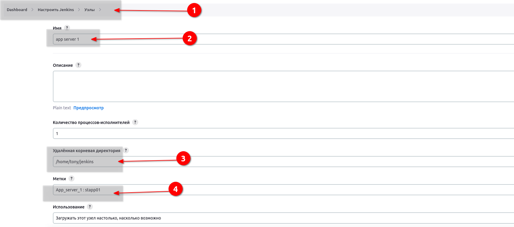
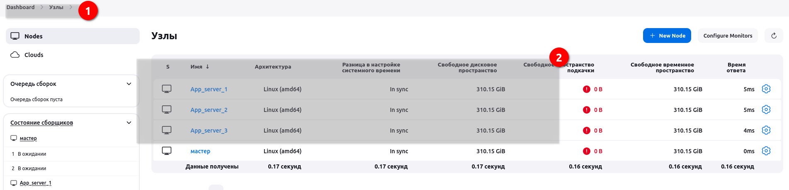

# Kodekloud. Jenkins Slave Nodes

The Nautilus DevOps team has installed and configured new Jenkins server in Stratos DC which they will use for CI/CD and for some automation tasks. There is a requirement to add all app servers as slave nodes in Jenkins so that they can perform tasks on these servers using Jenkins. Find below more details and accomplish the task accordingly.

Click on the Jenkins button on the top bar to access the Jenkins UI. Login using username admin and password Adm!n321.

1. Add all app servers as SSH build agent/slave nodes in Jenkins. Slave node name for app server 1, app server 2 and app server 3 must be App_server_1, App_server_2, App_server_3 respectively.

2. Add labels as below:

 - App_server_1 : stapp01

 - App_server_2 : stapp02

 - App_server_3 : stapp03

3. Remote root directory for App_server_1 must be /home/tony/jenkins, for App_server_2 must be /home/steve/jenkins and for App_server_3 must be /home/banner/jenkins.

4. Make sure slave nodes are online and working properly.

### Решение

Из плагинов:
- ssh
- SSH Credentials 
- SSH Build Agents 
- SSH Agent 

После установки идем в Node и создаем узлы согласоно условию задачи:

Так нужно еще и проверить доступность нодов, нужно дополнительно прописать:
`Launch agents via SSH` в меню способ запуска. А для этого нужны учетки. 

Сохраняем, создаем учетные записи и прописываем при настройке нодов. Настроил один, пытаюсь подключить. Нет. Смотрим лог.

`java.io.IOException: Java not found on hudson.slaves.SlaveComputer@d7e6a62. Install Java 8 or Java 11 on the Agent.`

Идем на сервер. Ставим:

`[root@stapp01 ~]# yum install java-11-openjdk-devel.x86_64`

Jenkins увидел агента. Проделываем аналогичные действия с остальными серверами.

