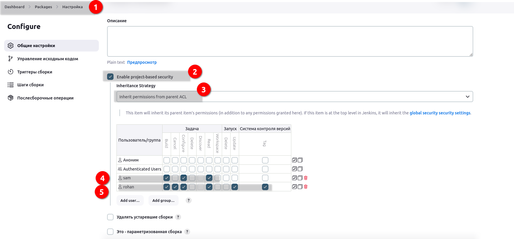

# Kodekloud. Jenkins Project Security

The xFusionCorp Industries has recruited some new developers. There are already some existing jobs on Jenkins and two of these new developers need permissions to access those jobs. The development team has already shared those requirements with the DevOps team, so as per details mentioned below grant required permissions to the developers.


Click on the Jenkins button on the top bar to access the Jenkins UI. Login using username admin and password Adm!n321.

* There is an existing Jenkins job named Packages, there are also two existing Jenkins users named sam with password sam@pass12345 and rohan with password rohan@pass12345.

* Grant permissions to these users to access Packages job as per details mentioned below:

* a.) Make sure to select Inherit permissions from parent ACL under inheritance strategy for granting permissions to these users.

* b.) Grant mentioned permissions to sam user : build, configure and read.

* c.) Grant mentioned permissions to rohan user : build, cancel, configure, read, update and tag.

Note:

* Please do not modify/alter any other existing job configuration. 


### Решение

Задание вижу. Создано. Сохраню себе его:
```bash
sshpass -p Ir0nM@n ssh -o 'StrictHostKeyChecking=no' -t tony@stapp01 'echo "Ir0nM@n" | sudo -S yum install git wget telnet net-tools zip -y'

sshpass -p Am3ric@ ssh -o 'StrictHostKeyChecking=no' -t steve@stapp02 'echo "Am3ric@" | sudo -S yum install git wget telnet net-tools zip -y'

sshpass -p BigGr33n ssh -o 'StrictHostKeyChecking=no' -t banner@stapp03 'echo "BigGr33n" | sudo -S yum install git wget telnet net-tools zip -y'
```

Пользователи также заведены.

Установим плагины __Matrix Authorization Strategy, Role-based Authorization Strategy__

В конфигурации задании настроить:


