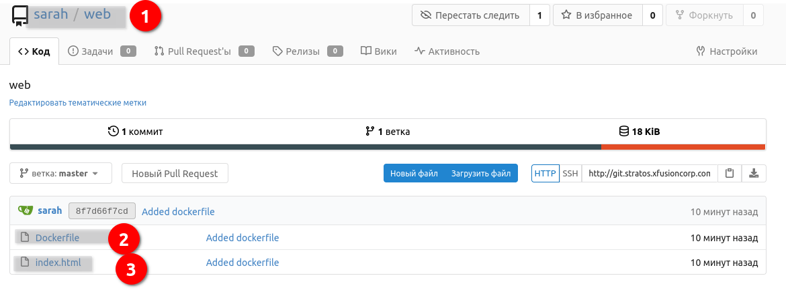
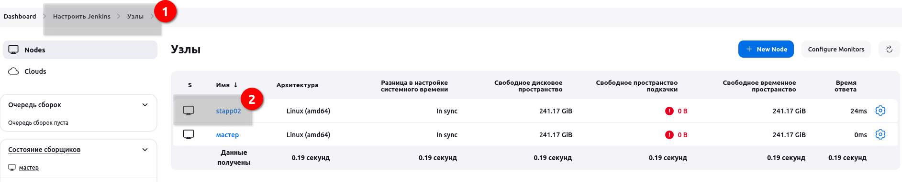

# Kodekloud. Jenkins Build Images

One of the DevOps engineers was working on to create a Dockerfile for Nginx. We need to build an image using that Dockerfile. The deployment must be done using a Jenkins pipeline. Below you can find more details about the same.


Click on the Jenkins button on the top bar to access the Jenkins UI. Login using username admin and password Adm!n321.

Similarly, click on the Gitea button on the top bar to access the Gitea UI. Login using username sarah and password Sarah_pass123. There is a repository named sarah/web in Gitea.

Create/configure a Jenkins pipeline job named nginx-container, configure it to run on server App Server 2.

- The pipeline can have just one stage named __Build__. (name is case sensitive)

- In the Build stage, build an image named stregi01.stratos.xfusioncorp.com:5000/nginx:latest using the Dockerfile present under the Git repository. stregi01.stratos.xfusioncorp.com:5000 is the image registry server. After building the image push the same to the image registry server.


### Решение

Нужно ставить плагины.
- Git
- SSH
- SSH Credentials
- SSH Build Agent
- Pipeline и еще пару тройку плагинов по нему.

На Gitea картинка такая, репозиторий не приватный.


Нужно скачать Dockerfile и запустить сборку образа. Docker только на удаленном сервере, значит запуск только там. Можно попробовать организовать через node\slave на требуемом сервере и тогда задание запуститься именно там, где установлен docker.

Заведем учетные данные для пользователя в Jenkins. 

Так как планируем заводить новый узел, необходимо установить на нем плагин java. Подключаемся к stapp02:
```bash
[steve@stapp02 ~]$ sudo yum install java-11-openjdk-devel.x86_64
```

И так как будем работать под steve, нужно убедиться, что установлен docker и пользователь в группе docker:
```bash
[steve@stapp02 ~]$ rpm -qa | grep -E 'java|docker'
javapackages-filesystem-5.3.0-1.module+el8+2447+6f56d9a6.noarch
java-11-openjdk-devel-11.0.23.0.9-3.el8.x86_64
docker-buildx-plugin-0.14.0-1.el8.x86_64
java-11-openjdk-headless-11.0.23.0.9-3.el8.x86_64
java-11-openjdk-11.0.23.0.9-3.el8.x86_64
docker-compose-plugin-2.27.0-1.el8.x86_64
docker-ce-cli-26.1.3-1.el8.x86_64
docker-ce-26.1.3-1.el8.x86_64
tzdata-java-2024a-1.el8.noarch
docker-ce-rootless-extras-26.1.3-1.el8.x86_64
[steve@stapp02 ~]$ docker -v
Docker version 26.1.3, build b72abbb
[steve@stapp02 ~]$ groups
steve wheel docker
```

Идем в ноды, добавляем, проверяем...




Создаем item pipeline. Видел похожие задания, попробую написать сам по аналогии.

```groovy
pipeline {
    agent {
        node {
            label 'stapp02'
        }
    }

    stages {
        stage('Build') {
            steps {
                git branch: "master",
                    url: "http://git.stratos.xfusioncorp.com/sarah/web.git"
                sh 'docker build -t stregi01.stratos.xfusioncorp.com:5000/nginx:latest .'
                sh 'docker push stregi01.stratos.xfusioncorp.com:5000/nginx:latest'
            }
        }
    }
}
```

Предлагают также использовать такой скрипт, но он проходит по условию задания.

pipeline {
    agent {
       label 'stapp1'
    }
	stages {
		stage('Build') {
		    steps {
		        script {
                    git credentialsId: 'git', url: 'http://git.stratos.xfusioncorp.com/sarah/web.git'
                    def dockerImage = docker.build('stregi01.stratos.xfusioncorp.com:5000/nginx:latest')
                    dockerImage.push()
		        }
		    }
		}
	}
}


