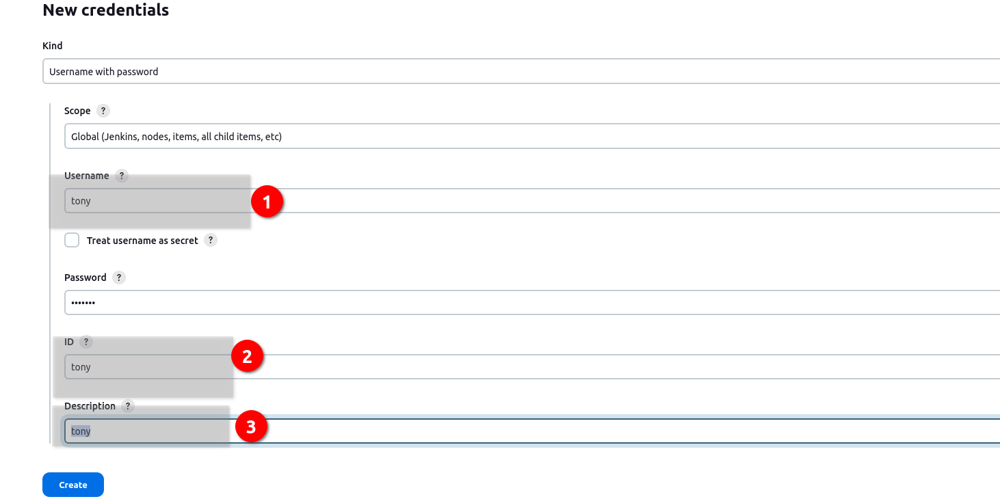

# Kodekloud. Jenkins Deployment Job

The Nautilus development team had a meeting with the DevOps team where they discussed automating the deployment of one of their apps using Jenkins (the one in Stratos Datacenter). They want to auto deploy the new changes in case any developer pushes to the repository. As per the requirements mentioned below configure the required Jenkins job.


Click on the Jenkins button on the top bar to access the Jenkins UI. Login using username admin and Adm!n321 password.

Similarly, you can access the Gitea UI using Gitea button, username and password for Git is sarah and Sarah_pass123 respectively. Under user sarah you will find a repository named web that is already cloned on the Storage server under sarah's home. sarah is a developer who is working on this repository.

1. Install httpd (whatever version is available in the yum repo by default) and configure it to serve on port 8080 on All app servers. You can make it part of your Jenkins job or you can do this step manually on all app servers.

2. Create a Jenkins job named nautilus-app-deployment and configure it in a way so that if anyone pushes any new change to the origin repository in master branch, the job should auto build and deploy the latest code on the Storage server under /var/www/html directory. Since /var/www/html on Storage server is shared among all apps.

3. SSH into Storage Server using sarah user credentials mentioned above. Under sarah user's home you will find a cloned Git repository named web. Under this repository there is an index.html file, update its content to Welcome to the xFusionCorp Industries, then push the changes to the origin into master branch. This push must trigger your Jenkins job and the latest changes must be deployed on the servers, also make sure it deploys the entire repository content not only index.html file.

Click on the App button on the top bar to access the app, you should be able to see the latest changes you deployed. Please make sure the required content is loading on the main URL https://<LBR-URL> i.e there should not be any sub-directory like https://<LBR-URL>/web etc.

Note:
1. You might need to install some plugins and restart Jenkins service. So, we recommend clicking on Restart Jenkins when installation is complete and no jobs are running on plugin installation/update page i.e update centre. Also some times Jenkins UI gets stuck when Jenkins service restarts in the back end so in such case please make sure to refresh the UI page.

2. Make sure Jenkins job passes even on repetitive runs as validation may try to build the job multiple times.

3. Deployment related tasks should be done by sudo user on the destination server to avoid any permission issues so make sure to configure your Jenkins job accordingly.

4. For these kind of scenarios requiring changes to be done in a web UI, please take screenshots so that you can share it with us for review in case your task is marked incomplete. You may also consider using a screen recording software such as loom.com to record and share your work.


### Решение

1. Плагины. Можно установить вручную, можно через [скрипт](Level_4_task1_plugin_scrpt.groovy).

- git
- credentials
- ssh
- pipeline (workflow-aggregator)
- SSH Build Agents
- SSH Pipeline Steps


1. Нужно установить httpd на app01,app02,app03 серверах, вручную или используя Jenkins. Настроить на порт 8080. Будем делать это, используя плагин SSH PipeLine Steps.

 * заходим на сервер stapp01 (и на других также) и даем возможность выполнять команды sudo без пароля:
 ```bash
[root@stapp01 ~]# sudo visudo

## Allows people in group wheel to run all commands
#%wheel ALL=(ALL)       ALL

## Same thing without a password
%wheel  ALL=(ALL)       NOPASSWD: ALL
```

 - прописываем учетные данные пользователя для сервера. Берем tony, stapp01. Пропиши так, как на скрине, потом будем их использовать в пайплайне.



 * Создаем [pipeline](Level_4_task1_httpd_pipeline.groovy)


В остальных пайплайнах меняем:
- строку с учетными данными`TONY_CREDS = credentials('steve')` 

```bash
remote.name = "stapp02"
remote.host = "172.16.238.11"
```
или banner соответственно.

Установка httpd, настройка конфига и запуск сервиса успешно завершен.

2. Настраиваем ноду на ststor01, лить репозиторий будем туда. Описано в предыдущих лабах.

3. Добавляем права на запись в каталог 

4. Пишем пайплайн:

```groovy
pipeline {
    agent { label 'stor01' }
    triggers { pollSCM('* * * * *') } // Запуск каждую минуту, если есть изменения в SCM

    stages {
        stage('Build') {
            steps {
                git branch: "master",
                    url: "http://git.stratos.xfusioncorp.com/sarah/web.git"
                sh 'cp /home/natasha/workspace/nautilus-app-deployment/* /var/www/html'
            }
        }
    }
}
```


