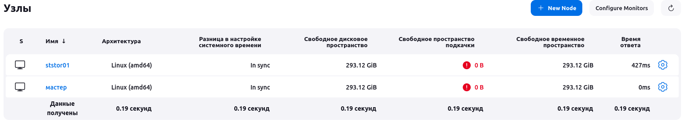
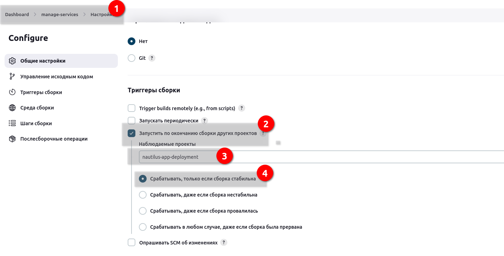
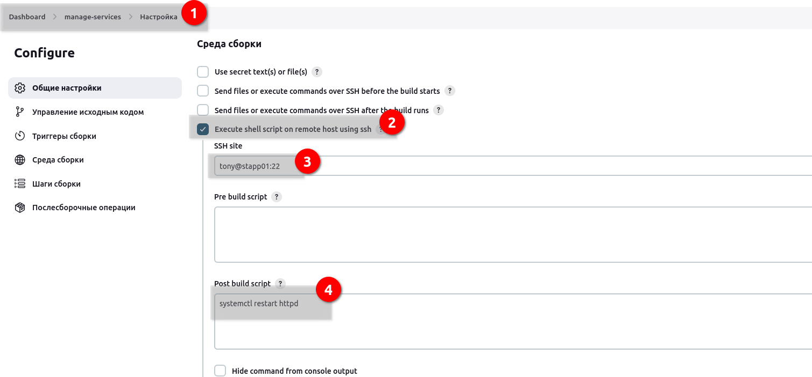

# Jenkins Chained Builds

The DevOps team was looking for a solution where they want to restart Apache service on all app servers if the deployment goes fine on these servers in Stratos Datacenter. After having a discussion, they came up with a solution to use Jenkins chained builds so that they can use a downstream job for services which should only be triggered by the deployment job. So as per the requirements mentioned below configure the required Jenkins jobs.


Click on the Jenkins button on the top bar to access the Jenkins UI. Login using username admin and Adm!n321 password.

Similarly you can access Gitea UI on port 8090 and username and password for Git is sarah and Sarah_pass123 respectively. Under user sarah you will find a repository named web.

Apache is already installed and configured on all app server so no changes are needed there. The doc root /var/www/html on all these app servers is shared among the Storage server under /var/www/html directory.

1. Create a Jenkins job named nautilus-app-deployment and configure it to pull change from the master branch of web repository on Storage server under /var/www/html directory, which is already a local git repository tracking the origin web repository. Since /var/www/html on Storage server is a shared volume so changes should auto reflect on all apps.

2. Create another Jenkins job named manage-services and make it a downstream job for nautilus-app-deployment job. Things to take care about this job are:

a. This job should restart httpd service on all app servers.

b. Trigger this job only if the upstream job i.e nautilus-app-deployment is stable.

LB server is already configured. Click on the App button on the top bar to access the app. You should be able to see the latest changes you made. Please make sure the required content is loading on the main URL https://<LBR-URL> i.e there should not be a sub-directory like https://<LBR-URL>/web etc.


### Решение

1. На сторэдж сервере склонирован репозиторий в каталог /var/www/html. Делаем слейв нодой storage и льем туда данные с репозитория gitea, через pipeline.

2. Следующим джобом необходимо перепустить сервисы на app1,2,3. Добавим ремоут хосты и выполним рестарт. Чтобы не прописывать пароли, через висудо дадим права на выполнение команд от судо без пароля.

3. Плагины:
 - git
 - ssh
 - SSH Build Agents
 - Publish Over SSH
 - pipeline
 - 

 4. Ноду настроил, Java-11 установил.

 

 5. Создаем пайплайн:
 ```groovy
pipeline {
    agent { label 'ststor01' }
    triggers { pollSCM('* * * * *') } // Запуск каждую минуту, если есть изменения в SCM

    stages {
        stage('Build') {
            steps {
                git branch: "master",
                    url: "http://git.stratos.xfusioncorp.com/sarah/web.git"
                sh 'cp /home/natasha/workspace/nautilus-app-deployment/* /var/www/html'
            }
        }
    }
}
```

6. Создаем следующее задание, с привязкой к успешному выполнению предыдущего.



Добавить sudo перед командой, не учел сразу. Сделал скрин.



