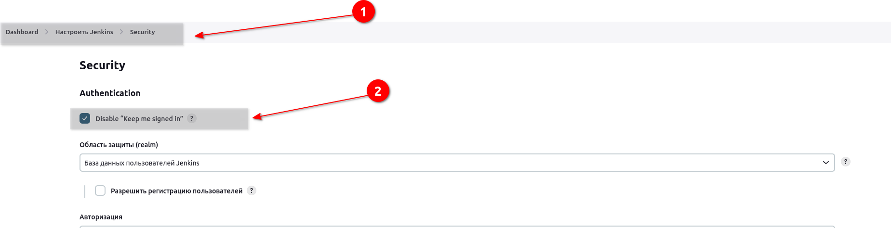
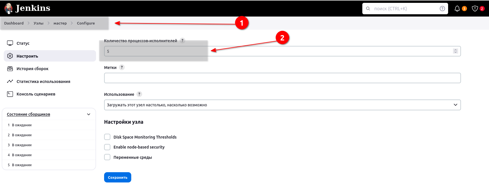
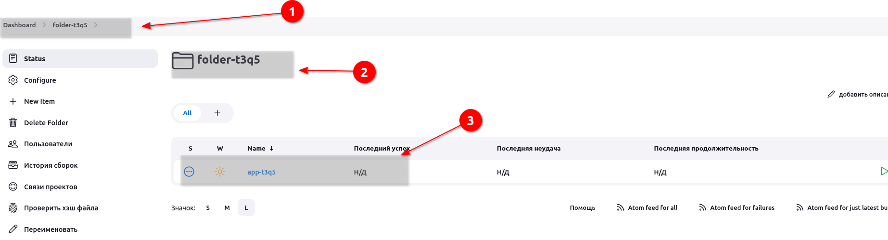
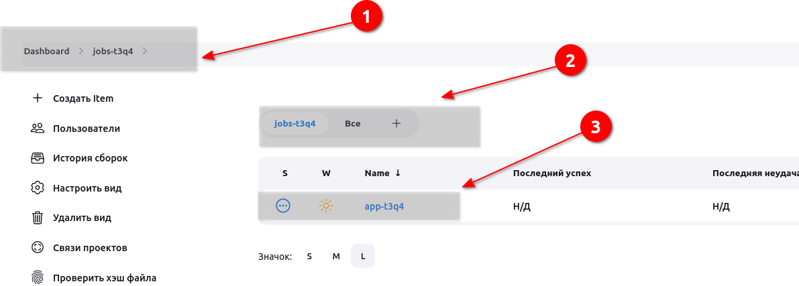
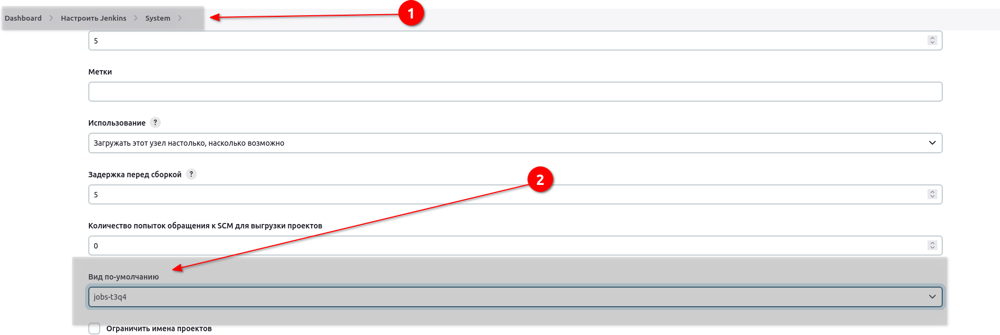
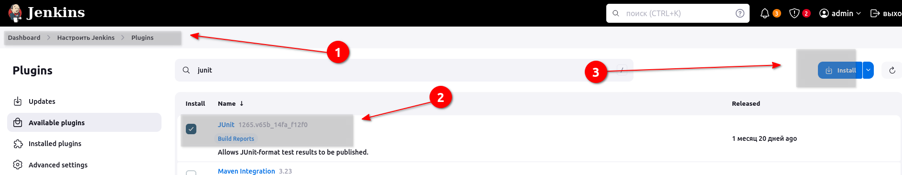
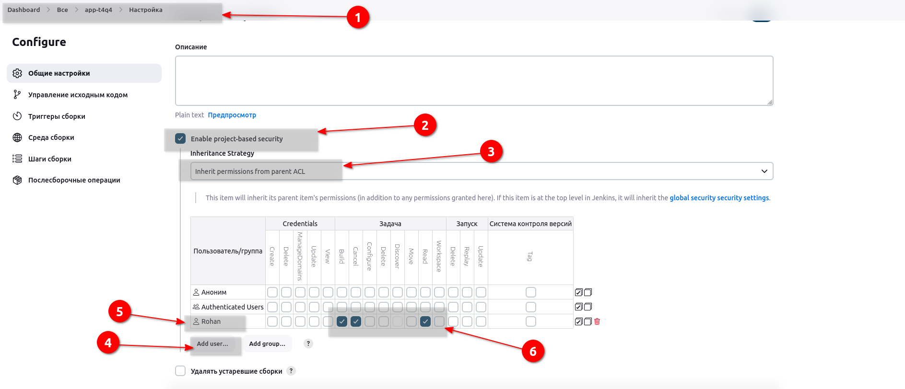
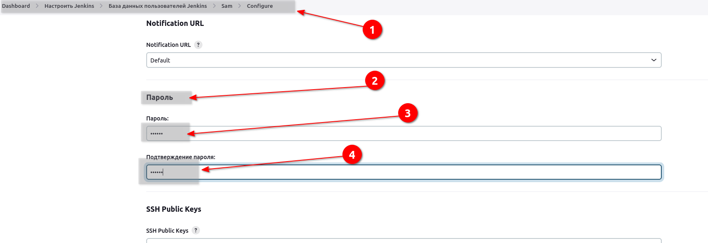
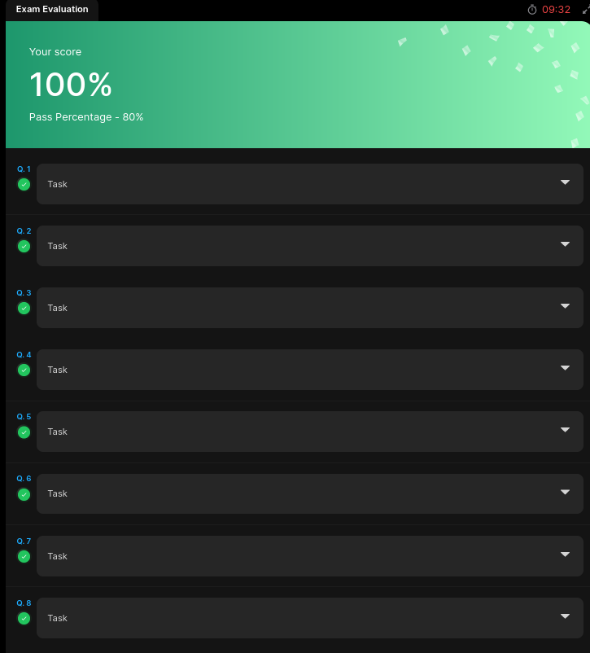

# Проверочные задачи по Jenkins

#### task1

After setting up the Jenkins server, the Nautilus team was analysing some security settings w.r.t the same. They wanted to disable the functionality to remember the login for a user so that user will have to login each time to the Jenkins server. They came up with below requirements for the same.

Turn on the Disable “Keep me signed in” option in Jenkins configuration.
```bash
vi /var/lib/jenkins/config.xml

jenkins@jenkins:~$ cat config.xml | grep -i "reme"
  <disableRememberMe>false</disableRememberMe>

```
Изменяю на true.

Также позже в заданиях дали пароль от веба, проверил и там.


#### task2

Since the Jenkins server was set up recently, there are still some configurations that need to be done. The team has just realised that they need to update the default executors in the Jenkins configuration.

Change the number of default executors to 5.

```bash
Тот же самый config.xml
jenkins@jenkins:~$ cat config.xml | grep -i "Exec"
  <numExecutors>2</numExecutors>
```
Изменяю на 5.

Опять же на момент задания доступа к вебу небыло. Проверил позже, сделал скрин


### task3

To manage the increasing number of jobs on the Jenkins server, the Nautilus team recognized the need to categorize them based on their nature, environment, etc. This categorisation would facilitate easier visualisation and organisation of the jobs. Consequently, similar to the views, the team intends to create a folder and relocate specific jobs accordingly.

Create a folder named __folder-t3q5__, and move the job __app-t3q5__ under the same.


#### Решение

Создал папочку, сделал move задания. Процесс описан в одной из практических задач.



### task4
To manage the increasing number of jobs on the Jenkins server, the Nautilus team recognized the need to categorize them based on their nature, environment, etc. This categorization would facilitate easier visualization and organization of the jobs. Consequently, the team intends to create a new view and relocate specific jobs accordingly.

Create a list view named jobs-t3q4 and list the job app-t3q4 under the same. Make sure this view is a global view.

#### Решение

В менюшке надо добавить list view и указать задание там.






### task5

The Nautilus DevOps team want to install and setup some Jenkins plugins which are needed by some of the jobs they are going to create. Recently they have shared below requirements.

Click on the Jenkins button on the top bar to access the Jenkins UI. Login using username admin and Adm!n321 password.

Install the Jenkins plugin Mailer, please keep it disabled for now. You might need to restart Jenkins service to install these plugins, so we recommend clicking on Restart Jenkins when installation is complete and no jobs are running on plugin installation/update page i.e update centre.

#### Решение

Через дашбоард установил mailer. Отметил как неактивный.


### task6
The Nautilus DevOps team is working on to configure a Jenkins server. They are working on to configuring a couple of pipelines and for that they need to install some plugins. Recently they have shared below requirements.

Install jenkins junit plugin. You might need to restart Jenkins service to install this plugin, so we recommend clicking on Restart Jenkins when installation is complete and no jobs are running on plugin installation/update page i.e update centre.

Click on the Jenkins button on the top bar to access the Jenkins UI. Login using username admin and Adm!n321 password.

#### Решение

Устанавливаем плагин. Перезапускаем Jenkins. Оставляю активным.




### Task7

The Nautilus DevOps team is configuring user permissions to ensure they can perform necessary operations within the Jenkins server, such as job creation, updating, deletion, and Jenkins configuration updates. Below are the shared requirements:

Grant below mentioned permissions to rohant4q4 user on app-t4q4 job. Also, make sure to select Inherit permissions from parent ACL under inheritance strategy for granting these permissions.

    build
    cancel
    read

### Решение




### Task8

The Nautilus DevOps team has recently installed a new Jenkins server and created few users and groups to grant access to different team members. They want to reset password for one of the users they created earlier.

Change password of user samt4q2 to S@m321.

#### Решение




#### Результат


