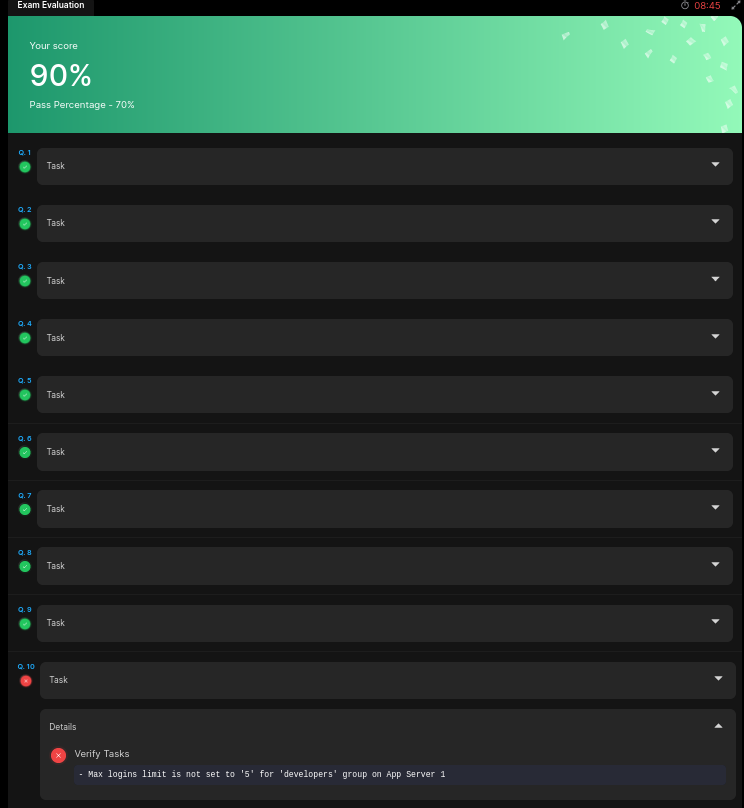

# Level 1. Экзаменационный тест

### Task1
The system admins team want to create a user on an app server in Stratos Datacenter. Create the user as per the details given below:

Create a user named rod with a non-interactive shell on App server 1 in Stratos Datacenter.

__Решение__

```bash
[tony@stapp01 ~]$ sudo useradd -s /sbin/nologin rod

[tony@stapp01 ~]$ cat /etc/passwd | tail
ftp:x:14:50:FTP User:/var/ftp:/sbin/nologin
nobody:x:65534:65534:Kernel Overflow User:/:/sbin/nologin
dbus:x:81:81:System message bus:/:/sbin/nologin
systemd-coredump:x:999:997:systemd Core Dumper:/:/sbin/nologin
systemd-resolve:x:193:193:systemd Resolver:/:/sbin/nologin
tss:x:59:59:Account used for TPM access:/dev/null:/sbin/nologin
sshd:x:74:74:Privilege-separated SSH:/var/empty/sshd:/sbin/nologin
ansible:x:1000:1000::/home/ansible:/bin/bash
tony:x:1001:1001::/home/tony:/bin/bash
rod:x:1002:1002::/home/rod:/sbin/nologin
```

### Task2

As part of the temporary resource allocation, Javed has been appointed to the Nautilus project as a backup developer. To facilitate this, a temporary user account is required for Javed. It is advisable to create a user account with a specified expiration date to ensure restricted server access beyond the designated period.

A user profile under the name javed has already been established on App Server 1 within the Stratos Datacenter. Adjust the account's expiration date to 2024-04-15. Additionally, locate all files (excluding directories) owned by this user within the /home/usersdata directory and copy them to the /ecommerce directory while maintaining their original ownership.

__Решение__

```bash
[tony@stapp01 ~]$ chage javed -l
chage: Permission denied.
[tony@stapp01 ~]$ sudo !!
sudo chage javed -l
Last password change                                    : May 05, 2024
Password expires                                        : never
Password inactive                                       : never
Account expires                                         : never
Minimum number of days between password change          : 0
Maximum number of days between password change          : 99999
Number of days of warning before password expires       : 7
```

Выдержка из ман для правильности внесения даты:
```bash
-E, --expiredate EXPIRE_DATE
           Set the date or number of days since January 1, 1970 on which the user's account will no longer be
           accessible. The date may also be expressed in the format YYYY-MM-DD (or the format more commonly
           used in your area). A user whose account is locked must contact the system administrator before
           being able to use the system again.
```

Вносим изменения:

```bash
[tony@stapp01 ~]$ sudo chage -E 2024-04-15 javed
[tony@stapp01 ~]$ sudo chage javed -l
Last password change                                    : May 05, 2024
Password expires                                        : never
Password inactive                                       : never
Account expires                                         : Apr 15, 2024
Minimum number of days between password change          : 0
Maximum number of days between password change          : 99999
Number of days of warning before password expires       : 7
[tony@stapp01 ~]$ 
```

Далее нужно скопировать файлы:

```bash
sudo find /home/usersdata -type f -user javed -exec cp -p {} /ecommerce/ \;
```

### Task3

There is a cron job that needs to be added to the Nautilus storage server in Stratos DC.The cron details is as below:

a. Install cronie package and start crond service.

b. Add this command to the crontab of root user:

/usr/bin/touch test_passed


Make it run every day at 21:30 (use 30 21 format in the expression).

__Решение__

устанавливаем. Устанавливаю и на stapp01 и на ststor01

```bash
sudo yum install cronie

sudo crontab -e

[tony@stapp01 ecommerce]$ sudo crontab -l
30 21 * * * /usr/bin/touch test_passed

[natasha@ststor01 ~]$ crontab -l
no crontab for natasha
[natasha@ststor01 ~]$ crontab -u root -l
must be privileged to use -u
[natasha@ststor01 ~]$ sudo crontab -u root -l
30 21 * * * /usr/bin/touch test_passed

```

### task4

The application development team needs some directories created on one of the app servers in Stratos Datacenter. They will use these directories to store some data. They have shared below requirements with us:


Create some directories as below under /opt directory on App server 1 in Stratos Datacenter.

/opt/app/backup/latest

__Решение__

```bash
sudo mkdir -p /opt/app/backup/latest

[tony@stapp01 latest]$ pwd
/opt/app/backup/latest

```

### task5
There are some specific requirements related to the permissions of some new directories/files. Create these directories/files and set appropriate permissions as mentioned below:

a. Create a directory named /usr/kke_data on App server 1 in Stratos Datacenter.

b. Further, create a file named /usr/kke_data/kke_data.txt and add This is a test file! line in this file.

c. The user owner of the /usr/kke_data directory and its contents should be root.

d. The /usr/kke_data/kke_data.txt file permissions should be 600.

__Решение__
```bash
[tony@stapp01 latest]$ sudo mkdir -p /usr/kke_data
[tony@stapp01 latest]$ cd /usr/kke_data
[tony@stapp01 kke_data]$ pwd
/usr/kke_data

[tony@stapp01 kke_data]$ sudo vi kke_data.txt 
[tony@stapp01 kke_data]$ cat kke_data.txt 
This is a test file!

[tony@stapp01 usr]$ stat kke_data/
  File: kke_data/
  Size: 4096            Blocks: 8          IO Block: 4096   directory
Device: e00070h/14680176d       Inode: 12863616    Links: 2
Access: (0755/drwxr-xr-x)  Uid: (    0/    root)   Gid: (    0/    root)
Access: 2024-05-05 07:10:49.606942037 +0000
Modify: 2024-05-05 07:10:46.086671295 +0000
Change: 2024-05-05 07:10:46.086671295 +0000
 Birth: 2024-05-05 07:08:40.921044877 +0000

 [tony@stapp01 kke_data]$ sudo chmod 600 kke_data.txt 
[tony@stapp01 kke_data]$ ls -la
total 12
drwxr-xr-x 2 root root 4096 May  5 07:10 .
drwxr-xr-x 1 root root 4096 May  5 07:08 ..
-rw------- 1 root root   21 May  5 07:10 kke_data.txt
```

### task6

The development team requires specific logs stored within the Nautilus storage server situated in the Stratos DC. Access the designated location on the server to retrieve the necessary logs. Further, perform below actions:

Create a tar archive named logs.tar (under natasha's home) of /var/log/ directory.
Now, create a compressed tar archive as well named logs.tar.gz (under natasha's home) of /var/log/ directory.

__Решение__

```bash
[tony@stapp01 kke_data]$ ssh natasha@ststor01
[natasha@ststor01 ~]$ sudo tar -cvf /home/natasha/logs.tar /var/log/
[natasha@ststor01 ~]$ sudo tar -czvf /home/natasha/logs.tar.gz /var/log/

[natasha@ststor01 ~]$ ls -la
total 500
drwx------ 1 natasha natasha   4096 May  5 07:21 .
drwxr-xr-x 1 root    root      4096 Oct 17  2023 ..
-rw------- 1 natasha natasha    205 May  5 07:03 .bash_history
-rw-r--r-- 1 natasha natasha     18 Jun 20  2022 .bash_logout
-rw-r--r-- 1 natasha natasha    141 Jun 20  2022 .bash_profile
-rw-r--r-- 1 natasha natasha    376 Jun 20  2022 .bashrc
-rw-r--r-- 1 root    root    460800 May  5 07:19 logs.tar
-rw-r--r-- 1 root    root     21695 May  5 07:21 logs.tar.gz
```

### task7

There is some data on Nautilus App Server 1 in Stratos DC. Data needs to be altered in some of the files. On Nautilus App Server 1, alter the /home/BSD.txt file as per details given below.


a. Delete all lines containing the word software and save the results in /home/BSD_DELETE.txt file. (Please be aware of case sensitivity)

b. Replace all occurrences of the word or (look for the exact match) with their and save the results in /home/BSD_REPLACE.txt file.

Note: Let's say you are asked to replace the word to with from. In that case, make sure not to alter any words containing the string itself, for example; upto, contributor etc.

__Решение__
```bash
thor@jump_host ~$ ssh tony@stapp01
[tony@stapp01 home]$ sudo grep -v 'software' BSD.txt > /home/tony/BSD_DELETE.txt
[tony@stapp01 home]$ cd tony/
[tony@stapp01 ~]$ sudo cp BSD_DELETE.txt /home/
[tony@stapp01 home]$ sudo sed 's/\bor\b/their/g' BSD.txt > /home/tony/BSD_REPLACE.txt
[tony@stapp01 home]$ sudo cp ~/BSD_REPLACE.txt /home
[tony@stapp01 home]$ ls -la
total 64
drwxr-xr-x 1 root    root    4096 May  5 07:43 .
drwxr-xr-x 1 root    root    4096 May  5 06:28 ..
-rw-r--r-- 1 tony    tony    9919 May  5 06:20 BSD.txt
-rw-r--r-- 1 root    root    8642 May  5 07:32 BSD_DELETE.txt
-rw-r--r-- 1 root    root    9991 May  5 07:43 BSD_REPLACE.txt
drwx------ 1 ansible ansible 4096 Mar  6  2023 ansible
drwx------ 2 javed   javed   4096 May  5 06:28 javed
drwx------ 2 rod     rod     4096 May  5 06:26 rod
drwx------ 1 tony    tony    4096 May  5 07:42 tony
drwxr-xr-x 5 root    root    4096 May  5 06:28 usersdata
```

Обратился к ChatGPT
```bash
You can use the sed command to achieve this. Here's the command:

sed 's/or/and/g' /path/to/original/file > /home/BSD_REPLACE.txt

Here's a breakdown of the options used:

    sed: The command to perform text substitution.
    s/or/and/g: The substitution command:
    + s: Substitute the pattern.
    + or: The pattern to replace (exact match).
    + and: The replacement string.
    + g: Global substitution, meaning all occurrences of the pattern will be replaced.
    /path/to/original/file: The original file that you want to modify.
    > /home/BSD_REPLACE.txt: Redirect the output to a new file /home/BSD_REPLACE.txt.

This command will read the original file, replace all occurrences of the word "or" with "and", and write the results to the new file /home/BSD_REPLACE.txt.

To avoid replacing words containing the string "or" itself, such as "upto" or "contributor", you can use a more sophisticated regular expression. For example:

sed 's/\bor\b/and/g' /path/to/original/file > /home/BSD_REPLACE.txt

The \b characters in the regular expression match word boundaries, ensuring that only whole words "or" are replaced, and not parts of other words.

```

### Task8

During recent servers audit, its was observed that some cleanup is needed on all app servers in Stratos Datacenter. Find below more details:


Remove virt-what package from all app servers in Stratos Datacenter.

__Решение__

Выполнить на всех серверах stapp01,02,03. Можно было через Ansible, но думаю суть не в этом. Да и времени мало.

```bash
[tony@stapp01 home]$ sudo yum remove virt-what
[tony@stapp01 home]$ ssh steve@stapp02
The authenticity of host 'stapp02 (172.16.238.11)' can't be established.
ECDSA key fingerprint is SHA256:9OvBVDlQ7BeLfkLZNJ8BcBdSr0dUHdaT0bmomijQpqQ.
Are you sure you want to continue connecting (yes/no/[fingerprint])? yes
Warning: Permanently added 'stapp02,172.16.238.11' (ECDSA) to the list of known hosts.
steve@stapp02's password: 
[steve@stapp02 ~]$ sudo yum remove virt-what
[banner@stapp03 ~]$ sudo yum remove virt-what

Removed:
  virt-what-1.25-2.el8.x86_64                                                                                    

Complete!
```

### task9

The xFusionCorp Industries security team recently did a security audit of their infrastructure and came up with some ideas to improve the application and server security. They decided to use SElinux for an additional security layer. They are still planning how they will implement it, however, they have decided to start testing with app servers, so based on the recommendations they have the following requirements:


Install the required packages of SElinux on App server 1 in Stratos Datacenter and disable it permanently for now, it will be enabled after making some required configuration changes on this host. Don't worry about rebooting the server as there is already a reboot scheduled during tonight's maintenance window. Also ignore the status of the SElinux command line right now; the final status after reboot should be disabled.

__Решение__

```bash
sudo yum install selinux-policy \
selinux-policy-targeted libselinux-utils \
setroubleshoot-server setools setools-console mcstrans

Complete!
[tony@stapp01 home]$ ls -la /etc/selinux/config
-rw-r--r-- 1 root root 548 May  5 07:55 /etc/selinux/config
[tony@stapp01 home]$ sudo sestatus
SELinux status:                 disabled

[tony@stapp01 home]$ sudo vi /etc/selinux/config

# This file controls the state of SELinux on the system.
# SELINUX= can take one of these three values:
#     enforcing - SELinux security policy is enforced.
#     permissive - SELinux prints warnings instead of enforcing.
#     disabled - No SELinux policy is loaded.
#SELINUX=enforcing
SELINUX=disabled
# SELINUXTYPE= can take one of these three values:
#     targeted - Targeted processes are protected,
#     minimum - Modification of targeted policy. Only selected processes are protected.
#     mls - Multi Level Security protection.
SELINUXTYPE=targeted
```

### task10

During the security audit last week, the security team found some issues on one of the app servers in Stratos DC. They shared a report and asked to apply some resource limits for some users.


Configure a resource limit (hard limit) for the developers group so that this group cannot exceed 5 logins (maxlogins) on App server 1 in Stratos Datacenter.

__Решение__

Ключевое - для группы developers

```bash
[tony@stapp01 home]$ sudo vi /etc/security/limits.conf

В конце конфига подсказка по группе student

#@student        hard    nproc           20
#@faculty        soft    nproc           20
#@faculty        hard    nproc           50
#ftp             hard    nproc           0
#@student        -       maxlogins       4
@developers      -       maxlogins       5

[tony@stapp01 home]$ cat /etc/security/limits.conf | tail
#*               soft    core            0
#*               hard    rss             10000
#@student        hard    nproc           20
#@faculty        soft    nproc           20
#@faculty        hard    nproc           50
#ftp             hard    nproc           0
#@student        -       maxlogins       4
@developers      -       maxlogins       5
```


Воспользовался chatgpt для уточнения:

```bash
To set a resource limit for the developers group to restrict the number of concurrent logins to 5 on a specific server, you can use the /etc/security/limits.conf file in conjunction with PAM (Pluggable Authentication Module). This configuration will affect all login methods that use PAM, including SSH and local logins.

Here's how to configure the hard limit for the max logins for the developers group:

    Open the terminal on App server 1 in the Stratos Datacenter.
    Edit the /etc/security/limits.conf file with a text editor such as nano or vi. You'll need superuser privileges to edit this file:

sudo nano /etc/security/limits.conf

    Add the following line to the end of the file:

@developers hard maxlogins 5

Explanation of the line added:

    @developers: The group name, prefixed with @ to indicate that it's a group, not a user.
    hard: Specifies that this is a hard limit, which cannot be exceeded.
    maxlogins: The type of limit being set, in this case, the maximum number of logins.
    5: The value for the limit, meaning the maximum number of logins allowed for the developers group is 5.

    Save the file and exit the text editor. If you're using nano, press CTRL+X followed by Y and then Enter to save and exit. If you're using vi, press :wq and then Enter.

    For the changes to take effect, the PAM system needs to be aware of them. Usually, no additional steps are required as PAM is already configured to use the limits.conf file on most systems.

    Test the configuration by attempting to log in more than 5 times simultaneously with users belonging to the developers group. The sixth login attempt should be denied.

Please note that this configuration will apply to all login methods that use PAM and will be enforced server-wide. Make sure that the PAM modules are correctly set up to enforce limits on your specific system, as there could be variations depending on the distribution and version of Linux you are using.

Additionally, remember that the effect of this setting is cumulative across all sessions for the developers group. If you have multiple servers where the developers group should be limited, you'll need to replicate this configuration on each server.
```


## Результаты

Последнее задание, забыл указать hard limits. Понятно. Признаю.


