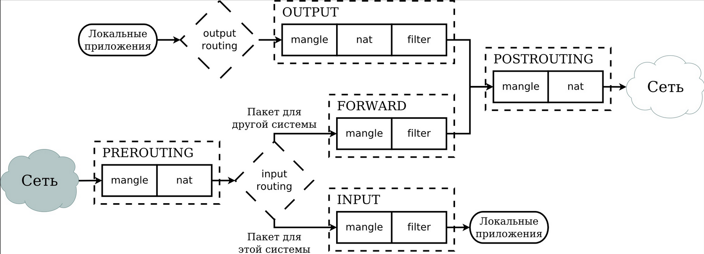

# [Статья на HABR: iptables](https://habr.com/ru/articles/747616/)

### Схема



<br>
Iptables работает путем проверки пакетов данных на соответствие определенным критериям и выполнения заданных действий, если пакеты соответствуют этим критериям. Эти критерии и действия определяются в таблицах, которые состоят из набора правил.

В Iptables есть четыре основные таблицы:

 - Filter - это основная таблица, используемая для фильтрации пакетов.

 - NAT - эта таблица используется для настройки NAT (Network Address Translation).

 - Mangle - эта таблица используется для специальной обработки пакетов.

 - Raw - эта таблица используется для обхода системы отслеживания состояний.

Каждая таблица состоит из набора цепочек. Цепочки - это последовательности правил, которые применяются к пакетам. В Iptables есть три встроенные цепочки:

 - INPUT - эта цепочка применяется к пакетам, которые предназначены для самой системы.

 - FORWARD - эта цепочка применяется к пакетам, которые проходят через систему.

 - OUTPUT - эта цепочка применяется к пакетам, которые исходят из системы.

### Просмотр 
Так смотрим изменения в применяемых правилах:
`watch -d iptables -L INPUT -n -v --line-numbers`

### Добавление правил
Нумерация правил:
`sudo iptables -L --line-numbers`

Вставить правило в начало цепочки:
`iptables -I INPUT -s 192.168.34.37 -j ACCEPT`

Добавить в начало -I правило разрешить на 8094 всем
`iptables -I INPUT -p tcp --dport 8094 -m comment --comment "accept nginx" -j ACCEPT`

Вставить правило на определеное место, в данном случае 2:
`sudo iptables -I INPUT 2 -p icmp -j REJECT`

Разрешить соединение на tcp порт всем (добавление в конец)
`iptables -A INPUT -p tcp --destination-port 22 -j ACCEPT`

Изменение дефолтной политики, добавлять в конце
`iptables -P INPUT DROP`

### Удаление правил

Удалить правило 3
`iptables -D INPUT 3`

__Примеры:__

Разрешить все входящие TCP-соединения на порт 8000 в iptables и добавить комментарий "vla", вы можете использовать следующую команду:
`sudo iptables -A INPUT -p tcp --dport 8000 -m comment --comment "vla" -j ACCEPT`

Вставить правило 2, запретить все входящие на порт 8084 с комментарием
`iptables -I INPUT 2 -p tcp --dport 8084 -m comment --comment "drop apache" -j DROP`

Разрешить входящие пакеты, которые являются частью уже установленного соединения
`iptables -A INPUT -m state --state ESTABLISHED,RELATED -j ACCEPT`

Разбор правила ACCEPT     all  --  *      *       0.0.0.0/0            0.0.0.0/0            ctstate RELATED,ESTABLISHED
```bash
Эта строка описывает правило в iptables, которое разрешает (ACCEPT) прохождение сетевых пакетов, если они относятся к уже установленным или связанным соединениям.

Давайте разберем каждый элемент этой строки:

    ACCEPT: действие, которое будет выполнено с пакетом, соответствующим условиям правила. В данном случае пакет будет пропущен.
    all: протокол, к которому применяется правило. all означает, что правило применяется ко всем протоколам (TCP, UDP, ICMP и т.д.).
    --: разделитель между протоколом и источником пакета.
    *: источник пакета. * означает любой источник.
    *: пункт назначения пакета. * означает любое назначение.
    0.0.0.0/0: IP-адрес источника. 0.0.0.0/0 означает любой IP-адрес.
    0.0.0.0/0: IP-адрес назначения. 0.0.0.0/0 означает любой IP-адрес.
    ctstate RELATED,ESTABLISHED: этот параметр относится к модулю conntrack и указывает, что правило применяется только к пакетам, которые относятся к уже установленным (ESTABLISHED) соединениям или связаны (RELATED) с ними.

В итоге, это правило разрешает прохождение всех пакетов, которые являются частью уже установленных соединений, или связаны с ними, независимо от протокола, источника и назначения.

Такое правило часто используется для того, чтобы разрешить ответы на исходящие запросы. Например, если ваш компьютер отправил запрос на веб-сервер, то ответ от сервера будет разрешен этим правилом, так как он связан с установленным соединением.
```

Заменить правило номер 5 в цепочке INPUT на новое правило, которое отклоняет все ICMP-пакеты
`iptables -R INPUT 5 -p icmp -j REJECT`

- `-R INPUT 5`: -R стоит для replace, что значит "заменить". Это заменяет правило под номером 5 в цепочке INPUT.
- `-p icmp`: Это указывает, что правило применяется к ICMP-пакетам. ICMP - это протокол, используемый для отправки сообщений об ошибках и операционной информации, такой как "echo request" (используемый в команде ping) или "destination unreachable".
- `-j REJECT`: Это говорит iptables отклонить пакеты, которые соответствуют этому правилу. REJECT - это одно из возможных действий, которые iptables может предпринять, и оно означает, что пакет будет отклонен и не будет обработан дальше.


### Сохранение и восстановление правил
По умолчанию, правила iptables не сохраняются после перезагрузки системы. Чтобы сохранить текущие правила, вы можете использовать команду iptables-save. Это выведет текущие правила в формате, который можно использовать для восстановления с помощью команды iptables-restore.

`iptables-save > /path/to/iptables/rules `

Затем, чтобы восстановить правила, вы можете использовать следующую команду:

`iptables-restore < /path/to/iptables/rules `

`service iptables save`

### Базовая конфигурация

```bash
iptables -I INPUT 1 -i lo -j ACCEPT
iptables -A INPUT -p tcp --dport 22 -j ACCEPT
iptables -A INPUT -m conntrack --ctstate ESTABLISHED, RELATED -j ACCEPT

```
Комментарии к рабочей конфигурации:

* `-A` INPUT: флаг -A (append) – добавляет правило в конец цепочки INPUT
* `-m conntrack`: этот параметр вызывает модуль conntrack для отслеживания информации о соединениях.
* `–ctstate` ESTABLISHED, RELATED: выделяем все соединения в состоянии ESTABLISHED (выделяется трафик по уже существующим соединениям) и RELATED (трафик по новым соединениям, но связанных с уже открытыми).
* `-j` `ACCEPT`: действие (target) – то, что будет произведено с пакетом, если он попал под критерий. В нашем случае это ACCEPT.
* `-p tcp`: фильтруем пакеты, использующие протокол TCP
* `–dport XXX`: выделяем TCP-пакеты с портом назачение XXX.
* Ключ `-I` (insert) указывает вставить правило в цепочку на 1-ое место. Порядковый номер вставки указывается за именем цепочки INPUT (напоминаем, что флаг -A добавляет правило в конец)
* `-i` `lo` – указываем интерфейс loopback и разрешаем трафик через него.


### Troubleshooting

- Ошибка в файле /etc/sysconfig/iptables: Возможно, при сохранении правил произошла какая-то ошибка, из-за чего файл был записан неправильно. Вы можете попробовать вручную проверить содержимое этого файла.

- Ошибка в загрузке правил при загрузке системы: Возможно, при загрузке системы произошла ошибка при загрузке правил из файла /etc/sysconfig/iptables. Вы можете попробовать вручную загрузить правила, выполнив команду iptables-restore < /etc/sysconfig/iptables.

- Другой сценарий загрузки правил: Если вы используете другой сценарий для загрузки правил iptables, например, с помощью systemd, то service iptables save может не работать, как ожидается. Вы можете проверить, как правила загружаются при загрузке системы.

- Конфликт с другими правилами: Возможно, существуют другие правила или сценарии, которые перезаписывают ваши правила. Вы можете попробовать отключить или изменить эти другие правила.

