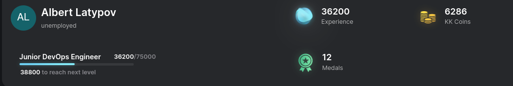

# KodeKloud Engineer. Этапы решения задач на платформе.

Привет! 👋 [Здесь можно перейти на главную страницу](/README.md)

## Ranking

- Обновлено 24/05/2024:
Системного администратора завершил. 

Путь к **Devops Senior**

## Этапы прохождения

 * [Linux page](/Kodekloud/Linux/README_linux.md)
 * [Git page](/Kodekloud/Git/README_git.md)
 * [Docker page](/Kodekloud/Docker/README_docker.md)
 * [Ansible page](/Kodekloud/Ansible/README_ansible.md)
 * [Jenkins page](/Kodekloud/Jenkins/README_jenkins.md)

