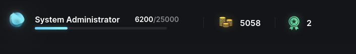

# KodeKloud Engineer

Привет! 👋

- В этой части отражаю мои этапы решения задач на платформе.
- До идеи создания данного репозитория решения задач не фиксировал. С данного момента буду отражать способ решения задачи

## Ranking

- Обновлено 03/05/2024: Путь к **System Administrator**

## Этапы прохождения

 * [Linux page](/Kodekloud/Linux/README_linux.md)
 * [Git page](/Kodekloud/Git/README_git.md)
 * [Docker page](/Kodekloud/Docker/README_docker.md)
 * [Ansible page](/Kodekloud/Ansible/README_ansible.md)
